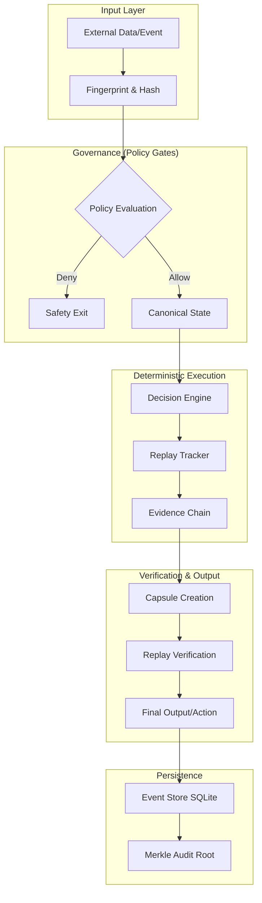

# Reach Concept Map

Reach removes unpredictable AI loops by enforcing a structured lifecycle. This diagram illustrates the flow from input to outcome.

## Core Flow Explained

1. **CLI/API Entry**: Requests enter via the `reach` CLI or SDK.
2. **Fingerprinting**: Inputs are immediately hashed to ensure a consistent starting point for replay.
3. **Policy Gates**: Decisions pass through a set of immutable rules (budget, safety, ethics) before execution.
4. **Engine Replay**: The Rust-based core engine evaluates branches deterministically. Every "random" seed is logged.
5. **Memory Storage**: Temporary state is managed in-process; final results are committed to the ledger.
6. **Evidence Outputs**: A portable capsule is generated, allowing any third party to re-verify the decision with bit-perfect accuracy.
