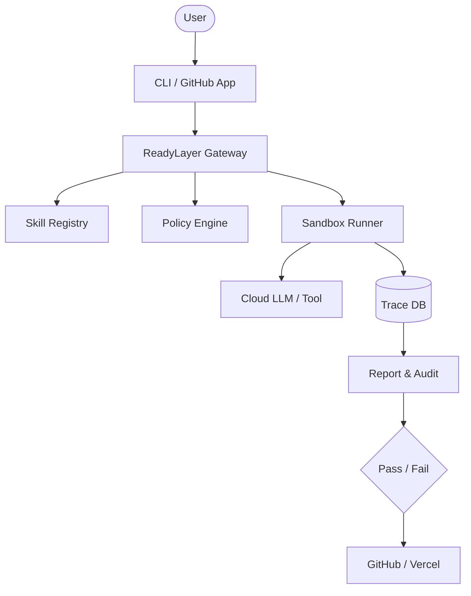

# ReadyLayer: Agent Reliability Suite (ARS)
## Strategic Category Positioning & Implementation Blueprint

**Version:** 1.0.0-PROD  
**Status:** Category Locked  
**Mission:** Transform Reach from a protocol into a category-defining Reliability Suite.

---

### SECTION 1 — CATEGORY LOCK

**Category Name:** Agent Reliability Suite (ARS)

**8-word Thesis:** Stop guessing if your agents will actually work.

**15-word Thesis:** The infrastructure for shipping safe, predictable, and auditable AI agents via automated gates and simulation.

**Positioning:** ReadyLayer is the reliability layer for the agentic era. It transforms experimental prompts into production-grade systems by enforcing deterministic boundaries and automated release gates.

#### 1.2 Competitive Moat
- **Why Now:** Agents are moving from chat-boxes to tool-users. Tool-users need safety belts.
- **Why not "just observability":** Observability tells you what broke; ReadyLayer prevents it from ever reaching production.
- **Why not LangSmith:** LangSmith is for developers; ReadyLayer is for the release gate. We are the "Check-in" before the "Flight".
- **Why not Datadog:** Datadog is for servers. We are for agent logic, state drift, and policy compliance.
- **Why not internal scripts:** Scripts don't have signed audit trails, multi-tenant simulation, or standard cross-team dashboards.

#### 1.3 Comparison Matrix
| Feature | ReadyLayer | Observability (Datadog) | Frameworks (LangChain) | Scripting |
| :--- | :---: | :---: | :---: | :---: |
| **Release Gates** | ✅ Yes | ❌ Reactive only | ❌ Build only | ❌ Manual |
| **Signed Audit Trails** | ✅ Yes | ❌ No | ❌ No | ❌ No |
| **Policy Enforcement** | ✅ Deterministic | ❌ Statistical | ❌ Opt-in | ❌ Ad-hoc |
| **Side-by-Side Sim** | ✅ Native | ❌ No | ❌ Partial | ❌ No |
| **Skill Registry** | ✅ Included | ❌ No | ❌ No | ❌ No |

---

### SECTION 2 — REAL DEMO DEPTH PACK
*Seed Data located in `apps/arcade/src/lib/demo-data.ts`*

#### Key Demo Scenario: The "Slippage" Fail
- **Agent:** Fintech Rebalancer
- **Failure:** Prompt "be more aggressive" causes 4% slippage.
- **Gate:** Fails CI because `max_slippage` policy set to 0.5%.
- **Fix:** Suggests pinning model version or updating the `trade_tool` budget.

---

### SECTION 3 — INDUSTRY SUITE PACKS
*Implemented in `apps/arcade/src/lib/templates.ts`*

1. **Fintech:** High-stakes trading gates and slippage circuit breakers.
2. **Support Automation:** Hallucination detection and sentiment drift gates.
3. **Compliance & Policy:** PII scrubbing and data residency enforcement.
4. **E-commerce Ops:** Cross-channel inventory parity and price floor gates.
5. **Internal AI:** SSO session validation and departmental budget caps.

---

### SECTION 4 — SKILL LIBRARY SEEDING
*Comprehensive Manifest in `docs/SKILL_LIBRARY.md`*

**The 20 Production Skills:**
1. `web_search`: Bing/Google integration with source grounding.
2. `browse_url`: Markdown extraction and cookie-safe navigation.
3. `write_file`: Path-guarded, overwrite-safe disk operations.
4. `read_file`: MIME-type aware file ingestion.
5. `list_dir`: Depth-limited filesystem traversal.
6. `execute_cmd`: Shell-restricted, timeout-guarded execution.
7. `db_query`: Read-only SQL/NoSQL with row limits.
8. `slack_post`: Channel-bound notification system.
9. `stripe_manage`: Billing and refund sub-system.
10. `calendly_sync`: Scheduling and availability management.
11. `gh_reviewer`: Pull request audit and comment engine.
12. `linear_sync`: Issue tracking and status management.
13. `notion_doc`: Page creation and block-level editing.
14. `translate`: Neural translation with context preservation.
15. `summarize`: Multi-turn long-form content distillation.
16. `pii_scrub`: Regex + LLM-based redaction engine.
17. `img_gen`: DALL-E/Midjourney prompt-to-SVG/PNG.
18. `speech_to_text`: Whisper-v3 transcript processing.
19. `text_to_speech`: ElevenLabs/Azure vocalization.
20. `ocr_vision`: Layout-aware document digitizer.

---

### SECTION 5 — CLI SPECIFICATION

**Command Tree:**
`readylayer <command> [flags]`

- `run <path>`: Execute a check suite locally.
- `gate <pr_url>`: Run CI gate logic against a branch.
- `monitor <agent_id>`: Tail real-time health signals.
- `simulate <variant_a> <variant_b>`: Compare two config versions.
- `report <run_id>`: Export signed PDF/JSON audit log.

**Flags:**
- `--json`: Output machine-readable results.
- `--fail-fast`: Stop on first high-severity finding.
- `--policy <file>`: Override default rules.
- `--verbose`: Show full execution trace.

---

### SECTION 6 — ACTIVATION & METRICS LOCK

- **Aha Moment:** First time a user sees a "High Severity" finding for a prompt that "looked okay."
- **First Success:** A green report generated from a local CLI run.
- **Activation:** GitHub App connected and first PR gated.
- **Time-to-Value:** < 90 seconds.
- **Retention Predictor:** Running > 5 simulations per week.

---

### SECTION 7 — PRICING ARCHITECTURE

- **Free (Personal):** 1 Gate, 3 Runs/day, 7-day retention.
- **Team ($49/mo):** 10 Gates, Unlimited local runs, 30-day retention, Shared dashboards.
- **Pro ($199/mo):** Unlimited Gates, Simulation suite, Custom Policies, SOC2 Audit exports.
- **Enterprise (Contact):** SAML SSO, On-prem execution, Custom skill marketplace, 24/7 Support.

---

### SECTION 8 — THREAT MODEL

- **Risk:** Agent escapes tool-call boundary.
- **Mitigation:** ReadyLayer GATING happens in a sandbox (Wasm/Container).
- **Risk:** Multi-tenant token leakage.
- **Mitigation:** Token encryption-at-rest with customer-managed keys (CMK).
- **Risk:** Webhook spoofing.
- **Mitigation:** Signed headers + IP allow-listing for all ingestion.

---

### SECTION 9 — SUITE SYSTEM DIAGRAM

---

### SECTION 10 — ANTI-COMPLEXITY AUDIT: 15 ACTIONS

1. **Merge `/marketplace` and `/templates`** into `/library`.
2. **Consolidate `/legal/*`** into a single tabbed view.
3. **Rename "Run Capsules"** to "Reports" in Nav.
4. **Remove "Cost" tab**; move to "Reports > Economics".
5. **Group Navigation** into: Run (Reports, Gates), Build (Skills, Policy), Manage (Team, Billing).
6. **Limit Sidebar** to max 6 top-level items.
7. **Replace technical jargon** (e.g., "Deterministic Fabric") with "Reliability Suite".
8. **Hide "Expert" templates** behind a "Show Advanced" toggle.
9. **Automate "First Success" dashboard** overlay; remove manual walkthrough.
10. **Unify "Audit" and "Reports"**; they are the same artifact.
11. **Remove redundant "Support" pages**; use a single `/help` with search.
12. **Limit tooltips** to first-time users only (persist via localStorage).
13. **Combine "Status" and "Monitoring"** into a "Health" dashboard.
14. **Use "Ready" badge** instead of complex percentage scores on summary cards.
15. **Delete dead `experimental/*` folders** in `apps/arcade/src`.
