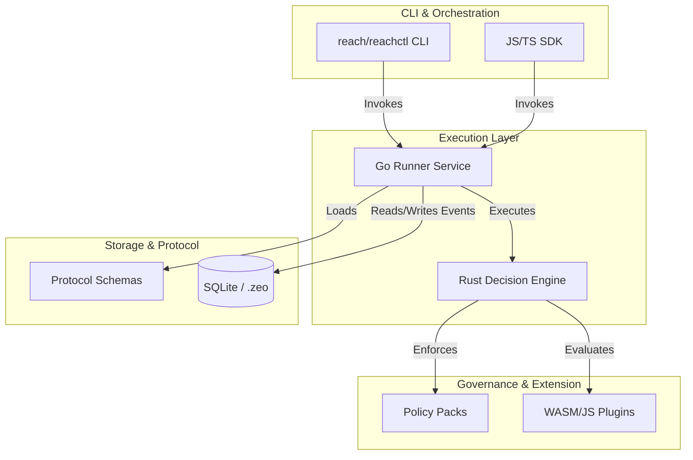

# Reach System Architecture

Reach is a deterministic execution fabric designed for agentic workflows. It follows a layered approach to ensure strict separation of concerns between presentation, orchestration, and core deterministic computation.

## System Diagram

## Layer Boundaries & Responsibilities

### 1. Interface Layer (CLI & SDK)

- **`reachctl` & `./reach`**: The primary entry points for developers and automation environments. Manage workspace orchestration, cryptographic signing, capsule generation, and command-line interactions.
- Provides commands for running packs, evaluating regressions, health checking, and exporting decision logs.
- Contains all user-facing flag logic and standard out formatting (`--json`).

### 2. Execution Layer (`services/runner` & `crates/decision-engine`)

**Responsibility:** The determinism boundary. This layer is responsible for running evaluations exactly the same way every time.

- **Go Runner (`services/runner`)**: Orchestrates the heavier lift of preparing the environment, downloading remote assets if required, and booting the engine. Maintains the boundary between non-deterministic triggers and deterministic execution.
- **Rust Decision Engine (`crates/decision-engine`)**: The high-performance, canonical core. It takes the context, events, and plugins, and computes the exact outcome and state mutations. It generates the deterministic `fingerprint`.

### 3. Governance & Extension Layer (`policy-packs` & `plugins`)

**Responsibility:** Providing modular, reusable rulesets and integrations without compromising the core engine.

- **Policy Packs**: Declarative JSON schemas that define compliance checks, routing rules, or organizational guardrails.
- **Plugins**: Sandboxed functions (often WASM or isolated JS) that perform custom evaluation logic (e.g., evaluating a complex AST).

### 4. Storage & Protocol Layer (`.zeo` & `protocol/`)

**Responsibility:** Defining the rigid data contracts and maintaining the immutable event stream.

- **Protocol Schemas**: Versioned JSON schemas dictating the exact structure of inputs, outputs, exceptions, and configuration data.
- **Local Storage (`SQLite`)**: Reach is local-first. The `.zeo` directory contains the SQLite database maintaining the event-sourced transcript of every workflow, run state, and cryptographic key material.

## Trust Boundaries & The Determinism Contract

- **Runner** owns runtime execution and capability firewalls.
- **Policy Packs** own allow/deny decisions based on signed provenance.
- **Client Interfaces** are presentation-only and cannot contain domain logic or secrets.

Across all these boundaries, Data is strictly canonicalized before crossing. When the Engine yields a decision, the resulting JSON is canonicalized and hashed (SHA-256 fingerprint), which is then immutably committed to Storage.
