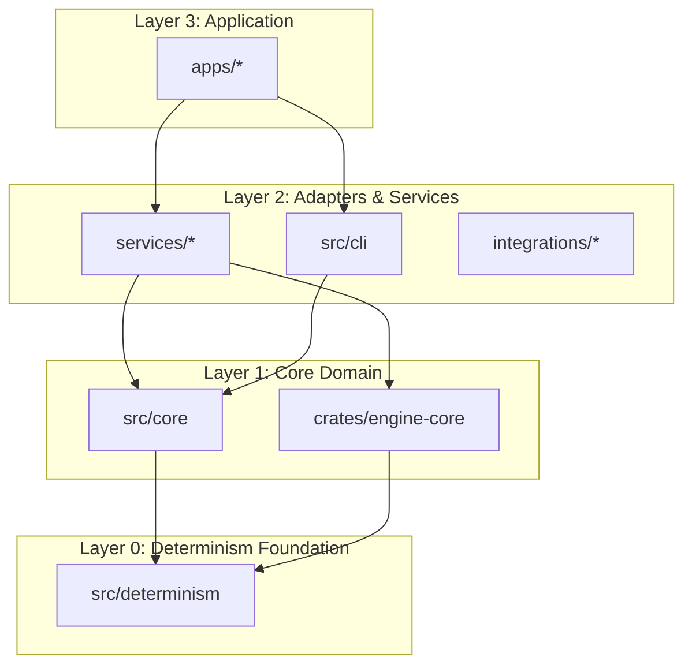

# Reach Architecture Boundaries

This document defines the authoritative dependency layers and boundary enforcement rules for the Reach project.

## Layer Diagram

## Boundary Rules

### 1. The Core Invariant

**Layer N may only depend on Layer N-1 or below.**

- **Forbidden**: `src/core` -> `src/cli`
- **Forbidden**: `src/core` -> `services/*`
- **Forbidden**: `src/determinism` -> `src/core`

### 2. Standard Library Isolation

**Layer 1 (Core)** depends only on Layers 0 and the language standard libraries.

- For TypeScript: `node:fs`, `node:crypto`, `node:path`.
- No dependencies on UI frameworks, external databases, or network-bound services (HTTP clients) in Layer 1.

### 3. Native Engine Symmetries

The TypeScript shim (`src/core/shim.ts`) MUST maintain interface parity with the Rust engine (`crates/engine-core`). Architectural changes to the decision process must be applied to both or abstracted behind a common interface in the SDK.

## Enforcement Mechanisms

- **Linter**: `npm run lint:structure` checks for forbidden imports using `tools/guard-structure.ps1`.
- **Typecheck**: Boundary violations often manifest as missing module errors if the `paths` in `tsconfig.json` are properly partitioned (Current: Work in Progress).
- **CI Gates**: `gates:reality` script enforces the "Antigravity" principles.

## Current Technical Debt

- `src/index.ts` currently bridges multiple entry points; should be consolidated into a single SDK entry point.
- `src/core/shim.ts` contains raw file I/O for trust profiles; this should be refactored into a `TrustStorage` interface.
