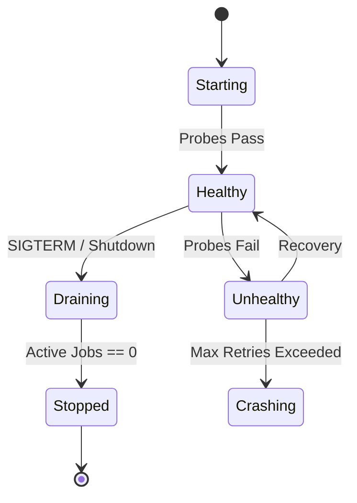

# Reach Operational Resilience

This document defines the operational lifecycle, failure modes, and recovery procedures for Reach services.

## 1. Service Lifecycle

All long-running services (Runner, Hub, Agent) must adhere to the following lifecycle states:



### Graceful Shutdown

Upon receiving `SIGINT` or `SIGTERM`:

1.  **Stop Ingestion**: HTTP servers return `503 Service Unavailable`.
2.  **Cancel Idle**: Terminate connections that are not actively processing a transaction.
3.  **Drain Active Jobs**: Allow running execution packs to reach a safe checkpoint (or timeout after 30s).
4.  **Flush Logs**: Ensure all buffered telemetry and event logs are written to disk/network.
5.  **Release Locks**: Explicitly release distributed locks (Redis/Postgres) to speed up failover.
6.  **Exit**: Return exit code 0.

## 2. Failure Modes & Recovery

### Class A: Ephemeral Node Failure (Crash/OOM)
**Symptom**: Runner process disappears.
**Recovery**:
- Orchestrator (K8s/Systemd) restarts process.
- **Startup Check**: Runner detects "Unclean Shutdown" marker in local storage.
- **Reconciliation**: Runner fetches latest state from Control Plane.
- **Resume**: Replays event log from last checkpoint.

### Class B: Storage Partition
**Symptom**: Writes to Event Log fail.
**Behavior**:
- **Circuit Breaker**: Open after 3 consecutive failures.
- **Fallback**: Buffer to local disk (if configured) or fail hard to preserve consistency.
- **Alert**: Critical severity alert emitted.

### Class C: Poison Pill (Deterministic Crash)
**Symptom**: A specific Execution Pack crashes the engine every time.
**Recovery**:
- **Quarantine**: After 3 crash loops on the same `RunID`, the Runner marks the Run as `QUARANTINED`.
- **Dead Letter Queue**: The input event is moved to DLQ for manual inspection.

## 3. Observability & Debugging

### Health Checks
- `/health/live`: Returns 200 if process is up.
- `/health/ready`: Returns 200 if connected to dependencies (DB, Queue) and ready to accept traffic.

### Safe Debug Commands

```bash
# Dump internal state of a running session without stopping it
reachctl debug dump-state <session_id>

# Verify integrity of the event log
reachctl audit verify <path/to/log.jsonl>
```

## 4. Data Integrity Invariants

1.  **Never Overwrite**: History is immutable.
2.  **Atomic Commit**: A transaction is only valid if the Event Log write succeeds.
3.  **Idempotency**: Replaying the same input event must result in the same state or a no-op.
