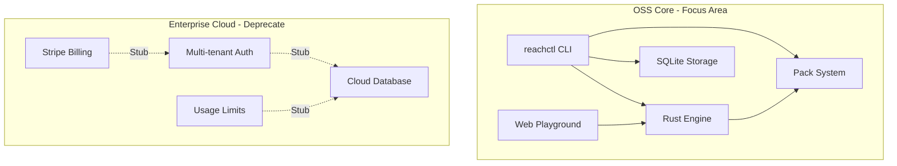
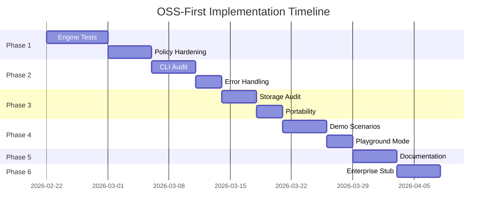

# ReadyLayer OSS-First Pivot Plan

**Status:** Draft  
**Created:** 2026-02-22  
**Objective:** Shift focus from enterprise paid cloud to rock-solid OSS fundamentals

---

## Executive Summary

This plan outlines a strategic pivot to prioritize the Open Source Software (OSS) offering before pursuing enterprise cloud monetization. The goal is to ensure all core gears and working parts run smoothly in reality before asking for money and multi-tenant trust.

### Why This Pivot?

1. **Prove the Core First** - The deterministic engine, policy gates, and signed packs must be bulletproof before anyone will trust them in production
2. **Build Community Trust** - OSS adoption creates organic trust that paid marketing cannot buy
3. **Reduce Complexity** - Multi-tenant cloud adds significant complexity; master single-tenant first
4. **Validate Product-Market Fit** - Let the OSS community validate the value proposition

---

## Architecture Overview



---

## Phase 1: Core Engine Fundamentals

**Goal:** Ensure the Rust deterministic engine is production-ready

### 1.1 Engine Test Coverage

- [ ] Audit existing test coverage in `crates/engine/tests/`
- [ ] Add property-based tests for determinism guarantees
- [ ] Verify replay integrity across all state transitions
- [ ] Test budget tracking edge cases

### 1.2 Policy Engine Hardening

- [ ] Verify all policy gates work correctly in `crates/engine/src/policy/`
- [ ] Test capability deny/allow logic exhaustively
- [ ] Ensure policy invariance under all execution paths

### 1.3 Execution Controls

- [ ] Verify `max_steps` enforcement
- [ ] Test `step_timeout` and `run_timeout` behavior
- [ ] Validate `budget_limit_usd` tracking accuracy
- [ ] Test `min_step_interval` rate limiting

### 1.4 Artifact Integrity

- [ ] Verify Merkle tree computation in `crates/engine/src/artifacts/`
- [ ] Test capsule creation and verification
- [ ] Ensure deterministic JSON serialization

**Files to Focus On:**
- `crates/engine/src/lib.rs`
- `crates/engine/src/policy/mod.rs`
- `crates/engine/src/state_machine.rs`
- `crates/engine/tests/`

---

## Phase 2: CLI Experience Hardening

**Goal:** Make `reachctl` the most reliable way to debug agents locally

### 2.1 Core Commands Audit

| Command | Status | Action Needed |
|---------|--------|---------------|
| `reach run` | Needs testing | Verify pack execution flow |
| `reach doctor` | Implemented | Add more diagnostic checks |
| `reach pack` | Implemented | Test lint/score/docs subcommands |
| `reach capsule` | Implemented | Verify create/verify/replay |
| `reach wizard` | Implemented | Test guided workflow |
| `reach share` | Implemented | Test QR code generation |

### 2.2 Error Handling

- [ ] Audit all error messages for clarity
- [ ] Ensure no panics on invalid input
- [ ] Add helpful suggestions for common errors
- [ ] Standardize exit codes

### 2.3 Local Workflow Validation

- [ ] Test: `reachctl run less than pack greater than` produces valid result
- [ ] Test: `reachctl doctor` passes on clean install
- [ ] Test: `reachctl capsule create less than run greater than` produces verifiable capsule
- [ ] Test: `reachctl capsule verify less than file greater than` confirms integrity

**Files to Focus On:**
- `services/runner/cmd/reachctl/main.go`
- `services/runner/internal/pack/`
- `services/runner/internal/determinism/`

---

## Phase 3: Local-First Data and Storage Layer

**Goal:** Ensure SQLite-based storage is robust for local use

### 3.1 Storage Layer Audit

- [ ] Verify SQLite migrations are idempotent
- [ ] Test concurrent access patterns
- [ ] Ensure proper WAL mode configuration
- [ ] Test database recovery scenarios

### 3.2 Data Directory Structure

```
data/
├── runs/           # Run records
├── packs/          # Installed packs
├── capsules/       # Exported capsules
├── plugins/        # Plugin storage
├── federation/     # Federation state
└── reach.db        # SQLite database
```

- [ ] Verify `REACH_DATA_DIR` environment variable works correctly
- [ ] Test clean initialization on fresh install
- [ ] Ensure proper file permissions

### 3.3 Run Record Portability

- [ ] Test `reachctl runs export` produces valid JSON
- [ ] Test `reachctl runs import` restores correctly
- [ ] Verify cross-platform compatibility

**Files to Focus On:**
- `services/runner/internal/storage/`
- `services/runner/cmd/reachctl/main.go` - runs export/import

---

## Phase 4: Web Playground and Demo Polish

**Goal:** Make the 30-second wow demo flawless for OSS adoption

### 4.1 Demo Scenarios

Implement the 5 "30-Second Wow" scripts from strategy:

1. **The Policy Breach** - Show unauthorized tool call blocked
2. **The Silent Regression** - Show prompt sensitivity detection
3. **The Budget Guard** - Show economic breach detection
4. **The Signed Pack** - Show Merkle tree verification
5. **The Mobile Switch** - Show QR share functionality

### 4.2 Playground Mode

- [ ] Ensure playground works without authentication
- [ ] Test demo data seeding
- [ ] Verify all sample packs execute correctly
- [ ] Add clear "Run Demo" call-to-action

### 4.3 Local Development Mode

- [ ] `npm run dev` starts without external dependencies
- [ ] All OSS features work without Stripe/Auth
- [ ] Clear documentation for local development setup

**Files to Focus On:**
- `apps/arcade/src/app/`
- `apps/arcade/src/lib/templates.ts`
- `apps/arcade/src/lib/demo-data.ts`

---

## Phase 5: Documentation and Developer Experience

**Goal:** Make OSS adoption frictionless

### 5.1 README Polish

- [ ] Verify 60-second local demo works as documented
- [ ] Update architecture diagram for OSS focus
- [ ] Remove enterprise-specific instructions

### 5.2 API Documentation

- [ ] Document all CLI commands with examples
- [ ] Create pack development guide
- [ ] Document policy gate configuration

### 5.3 Contributing Guide

- [ ] Clear development setup instructions
- [ ] Document test running procedures
- [ ] Explain project structure

### 5.4 Error Code Reference

- [ ] Ensure `docs/ERROR_CODES.md` is complete
- [ ] Add troubleshooting for common issues

---

## Phase 6: Deprecate/Stub Enterprise Cloud Features

**Goal:** Remove complexity while preserving future extensibility

### 6.1 Billing System

**Current State:** Stripe integration in `apps/arcade/src/lib/stripe.ts`

**Action:**
- [ ] Create `BillingDisabledError` fallback (already exists)
- [ ] Ensure all billing routes return graceful "not available" responses
- [ ] Remove Stripe from required dependencies

### 6.2 Multi-Tenant Auth

**Current State:** `requireAuth`, `tenantId` throughout API routes

**Action:**
- [ ] Create OSS mode that bypasses auth for local development
- [ ] Add `OSS_MODE=true` environment variable
- [ ] Stub `requireAuth` to return default user in OSS mode
- [ ] Remove tenant isolation logic in OSS mode

### 6.3 Cloud Database

**Current State:** `apps/arcade/src/lib/cloud-db.ts`

**Action:**
- [ ] Create in-memory or SQLite fallback for OSS mode
- [ ] Ensure playground works without cloud database
- [ ] Document local data persistence

### 6.4 Pricing Page

**Current State:** `apps/arcade/src/app/pricing/page.tsx`

**Action:**
- [ ] Update to emphasize "Free and Open Source"
- [ ] Remove enterprise tier or mark as "Coming Later"
- [ ] Add link to self-hosting documentation

### 6.5 API Routes Audit

Routes requiring `requireAuth` that need OSS fallback:

| Route | OSS Behavior |
|-------|--------------|
| `/api/v1/billing/*` | Return "Not available in OSS mode" |
| `/api/v1/gates/*` | Use local storage |
| `/api/v1/workflows/*` | Use local storage |
| `/api/v1/projects/*` | Use local storage |
| `/api/v1/auth/*` | Bypass in OSS mode |

---

## Success Criteria

### Phase 1 Complete When:
- [ ] All engine tests pass with greater than 90% coverage
- [ ] Property-based tests prove determinism
- [ ] No panics in engine under any input

### Phase 2 Complete When:
- [ ] All CLI commands work without errors
- [ ] `reach doctor` passes on clean install
- [ ] Error messages are helpful and actionable

### Phase 3 Complete When:
- [ ] SQLite storage handles all edge cases
- [ ] Run export/import works cross-platform
- [ ] No data corruption under normal use

### Phase 4 Complete When:
- [ ] All 5 demo scenarios work flawlessly
- [ ] Playground loads without authentication
- [ ] Local dev setup takes less than 5 minutes

### Phase 5 Complete When:
- [ ] README demo works as documented
- [ ] All CLI commands documented
- [ ] Contributing guide is complete

### Phase 6 Complete When:
- [ ] App runs without Stripe keys
- [ ] App runs without auth service
- [ ] Pricing page reflects OSS focus

---

## Files Changed Summary

### Core Engine (Phase 1)
- `crates/engine/src/*.rs`
- `crates/engine/tests/*.rs`
- `crates/engine-core/src/*.rs`

### CLI (Phase 2)
- `services/runner/cmd/reachctl/main.go`
- `services/runner/internal/pack/*.go`
- `services/runner/internal/determinism/*.go`

### Storage (Phase 3)
- `services/runner/internal/storage/*.go`

### Web App (Phase 4-6)
- `apps/arcade/src/lib/stripe.ts`
- `apps/arcade/src/lib/cloud-db.ts`
- `apps/arcade/src/lib/cloud-auth.ts`
- `apps/arcade/src/app/pricing/page.tsx`
- `apps/arcade/src/app/api/v1/**/*.ts`

### Documentation (Phase 5)
- `README.md`
- `docs/ERROR_CODES.md`
- `CONTRIBUTING.md`

---

## Risk Mitigation

| Risk | Mitigation |
|------|------------|
| Breaking existing cloud users | Feature flag for OSS mode |
| Lost revenue opportunity | OSS builds trust for future enterprise |
| Community does not adopt | Focus on developer experience |
| Core engine bugs found | Comprehensive testing phase |

---

## Next Steps

1. **Review this plan** with stakeholders
2. **Create GitHub issues** for each checklist item
3. **Begin Phase 1** with engine test audit
4. **Track progress** in project board

---

*This plan prioritizes building a rock-solid foundation before adding the complexity of multi-tenant cloud operations.*

**Status:** Draft  
**Created:** 2026-02-22  
**Objective:** Shift focus from enterprise paid cloud to rock-solid OSS fundamentals

---

## Executive Summary

This plan outlines a strategic pivot to prioritize the Open Source Software (OSS) offering before pursuing enterprise cloud monetization. The goal is to ensure all core gears and working parts run smoothly in reality before asking for money and multi-tenant trust.

### Why This Pivot?

1. **Prove the Core First** - The deterministic engine, policy gates, and signed packs must be bulletproof before anyone will trust them in production
2. **Build Community Trust** - OSS adoption creates organic trust that paid marketing cannot buy
3. **Reduce Complexity** - Multi-tenant cloud adds significant complexity; master single-tenant first
4. **Validate Product-Market Fit** - Let the OSS community validate the value proposition

---

## Architecture Overview


---

## Phase 1: Core Engine Fundamentals

**Goal:** Ensure the Rust deterministic engine is production-ready

### 1.1 Engine Test Coverage

- [ ] Audit existing test coverage in `crates/engine/tests/`
- [ ] Add property-based tests for determinism guarantees
- [ ] Verify replay integrity across all state transitions
- [ ] Test budget tracking edge cases

### 1.2 Policy Engine Hardening

- [ ] Verify all policy gates work correctly in `crates/engine/src/policy/`
- [ ] Test capability deny/allow logic exhaustively
- [ ] Ensure policy invariance under all execution paths

### 1.3 Execution Controls

- [ ] Verify `max_steps` enforcement
- [ ] Test `step_timeout` and `run_timeout` behavior
- [ ] Validate `budget_limit_usd` tracking accuracy
- [ ] Test `min_step_interval` rate limiting

### 1.4 Artifact Integrity

- [ ] Verify Merkle tree computation in `crates/engine/src/artifacts/`
- [ ] Test capsule creation and verification
- [ ] Ensure deterministic JSON serialization

**Files to Focus On:**
- `crates/engine/src/lib.rs`
- `crates/engine/src/policy/mod.rs`
- `crates/engine/src/state_machine.rs`
- `crates/engine/tests/`

---

## Phase 2: CLI Experience Hardening

**Goal:** Make `reachctl` the most reliable way to debug agents locally

### 2.1 Core Commands Audit

| Command | Status | Action Needed |
|---------|--------|---------------|
| `reach run` | Needs testing | Verify pack execution flow |
| `reach doctor` | Implemented | Add more diagnostic checks |
| `reach pack` | Implemented | Test lint/score/docs subcommands |
| `reach capsule` | Implemented | Verify create/verify/replay |
| `reach wizard` | Implemented | Test guided workflow |
| `reach share` | Implemented | Test QR code generation |

### 2.2 Error Handling

- [ ] Audit all error messages for clarity
- [ ] Ensure no panics on invalid input
- [ ] Add helpful suggestions for common errors
- [ ] Standardize exit codes

### 2.3 Local Workflow Validation

- [ ] Test: `reachctl run less than pack greater than` produces valid result
- [ ] Test: `reachctl doctor` passes on clean install
- [ ] Test: `reachctl capsule create less than run greater than` produces verifiable capsule
- [ ] Test: `reachctl capsule verify less than file greater than` confirms integrity

**Files to Focus On:**
- `services/runner/cmd/reachctl/main.go`
- `services/runner/internal/pack/`
- `services/runner/internal/determinism/`

---

## Phase 3: Local-First Data and Storage Layer

**Goal:** Ensure SQLite-based storage is robust for local use

### 3.1 Storage Layer Audit

- [ ] Verify SQLite migrations are idempotent
- [ ] Test concurrent access patterns
- [ ] Ensure proper WAL mode configuration
- [ ] Test database recovery scenarios

### 3.2 Data Directory Structure

```
data/
├── runs/           # Run records
├── packs/          # Installed packs
├── capsules/       # Exported capsules
├── plugins/        # Plugin storage
├── federation/     # Federation state
└── reach.db        # SQLite database
```

- [ ] Verify `REACH_DATA_DIR` environment variable works correctly
- [ ] Test clean initialization on fresh install
- [ ] Ensure proper file permissions

### 3.3 Run Record Portability

- [ ] Test `reachctl runs export` produces valid JSON
- [ ] Test `reachctl runs import` restores correctly
- [ ] Verify cross-platform compatibility

**Files to Focus On:**
- `services/runner/internal/storage/`
- `services/runner/cmd/reachctl/main.go` - runs export/import

---

## Phase 4: Web Playground and Demo Polish

**Goal:** Make the 30-second wow demo flawless for OSS adoption

### 4.1 Demo Scenarios

Implement the 5 "30-Second Wow" scripts from strategy:

1. **The Policy Breach** - Show unauthorized tool call blocked
2. **The Silent Regression** - Show prompt sensitivity detection
3. **The Budget Guard** - Show economic breach detection
4. **The Signed Pack** - Show Merkle tree verification
5. **The Mobile Switch** - Show QR share functionality

### 4.2 Playground Mode

- [ ] Ensure playground works without authentication
- [ ] Test demo data seeding
- [ ] Verify all sample packs execute correctly
- [ ] Add clear "Run Demo" call-to-action

### 4.3 Local Development Mode

- [ ] `npm run dev` starts without external dependencies
- [ ] All OSS features work without Stripe/Auth
- [ ] Clear documentation for local development setup

**Files to Focus On:**
- `apps/arcade/src/app/`
- `apps/arcade/src/lib/templates.ts`
- `apps/arcade/src/lib/demo-data.ts`

---

## Phase 5: Documentation and Developer Experience

**Goal:** Make OSS adoption frictionless

### 5.1 README Polish

- [ ] Verify 60-second local demo works as documented
- [ ] Update architecture diagram for OSS focus
- [ ] Remove enterprise-specific instructions

### 5.2 API Documentation

- [ ] Document all CLI commands with examples
- [ ] Create pack development guide
- [ ] Document policy gate configuration

### 5.3 Contributing Guide

- [ ] Clear development setup instructions
- [ ] Document test running procedures
- [ ] Explain project structure

### 5.4 Error Code Reference

- [ ] Ensure `docs/ERROR_CODES.md` is complete
- [ ] Add troubleshooting for common issues

---

## Phase 6: Deprecate/Stub Enterprise Cloud Features

**Goal:** Remove complexity while preserving future extensibility

### 6.1 Billing System

**Current State:** Stripe integration in `apps/arcade/src/lib/stripe.ts`

**Action:**
- [ ] Create `BillingDisabledError` fallback (already exists)
- [ ] Ensure all billing routes return graceful "not available" responses
- [ ] Remove Stripe from required dependencies

### 6.2 Multi-Tenant Auth

**Current State:** `requireAuth`, `tenantId` throughout API routes

**Action:**
- [ ] Create OSS mode that bypasses auth for local development
- [ ] Add `OSS_MODE=true` environment variable
- [ ] Stub `requireAuth` to return default user in OSS mode
- [ ] Remove tenant isolation logic in OSS mode

### 6.3 Cloud Database

**Current State:** `apps/arcade/src/lib/cloud-db.ts`

**Action:**
- [ ] Create in-memory or SQLite fallback for OSS mode
- [ ] Ensure playground works without cloud database
- [ ] Document local data persistence

### 6.4 Pricing Page

**Current State:** `apps/arcade/src/app/pricing/page.tsx`

**Action:**
- [ ] Update to emphasize "Free and Open Source"
- [ ] Remove enterprise tier or mark as "Coming Later"
- [ ] Add link to self-hosting documentation

### 6.5 API Routes Audit

Routes requiring `requireAuth` that need OSS fallback:

| Route | OSS Behavior |
|-------|--------------|
| `/api/v1/billing/*` | Return "Not available in OSS mode" |
| `/api/v1/gates/*` | Use local storage |
| `/api/v1/workflows/*` | Use local storage |
| `/api/v1/projects/*` | Use local storage |
| `/api/v1/auth/*` | Bypass in OSS mode |

---

## Success Criteria

### Phase 1 Complete When:
- [ ] All engine tests pass with greater than 90% coverage
- [ ] Property-based tests prove determinism
- [ ] No panics in engine under any input

### Phase 2 Complete When:
- [ ] All CLI commands work without errors
- [ ] `reach doctor` passes on clean install
- [ ] Error messages are helpful and actionable

### Phase 3 Complete When:
- [ ] SQLite storage handles all edge cases
- [ ] Run export/import works cross-platform
- [ ] No data corruption under normal use

### Phase 4 Complete When:
- [ ] All 5 demo scenarios work flawlessly
- [ ] Playground loads without authentication
- [ ] Local dev setup takes less than 5 minutes

### Phase 5 Complete When:
- [ ] README demo works as documented
- [ ] All CLI commands documented
- [ ] Contributing guide is complete

### Phase 6 Complete When:
- [ ] App runs without Stripe keys
- [ ] App runs without auth service
- [ ] Pricing page reflects OSS focus

---

## Files Changed Summary

### Core Engine (Phase 1)
- `crates/engine/src/*.rs`
- `crates/engine/tests/*.rs`
- `crates/engine-core/src/*.rs`

### CLI (Phase 2)
- `services/runner/cmd/reachctl/main.go`
- `services/runner/internal/pack/*.go`
- `services/runner/internal/determinism/*.go`

### Storage (Phase 3)
- `services/runner/internal/storage/*.go`

### Web App (Phase 4-6)
- `apps/arcade/src/lib/stripe.ts`
- `apps/arcade/src/lib/cloud-db.ts`
- `apps/arcade/src/lib/cloud-auth.ts`
- `apps/arcade/src/app/pricing/page.tsx`
- `apps/arcade/src/app/api/v1/**/*.ts`

### Documentation (Phase 5)
- `README.md`
- `docs/ERROR_CODES.md`
- `CONTRIBUTING.md`

---

## Risk Mitigation

| Risk | Mitigation |
|------|------------|
| Breaking existing cloud users | Feature flag for OSS mode |
| Lost revenue opportunity | OSS builds trust for future enterprise |
| Community does not adopt | Focus on developer experience |
| Core engine bugs found | Comprehensive testing phase |

---

## Next Steps

1. **Review this plan** with stakeholders
2. **Create GitHub issues** for each checklist item
3. **Begin Phase 1** with engine test audit
4. **Track progress** in project board

---

*This plan prioritizes building a rock-solid foundation before adding the complexity of multi-tenant cloud operations.*

- `CONTRIBUTING.md`

---

## Risk Mitigation

| Risk | Mitigation |
|------|------------|
| Breaking existing cloud users | Feature flag for OSS mode |
| Lost revenue opportunity | OSS builds trust for future enterprise |
| Community doesn't adopt | Focus on developer experience |
| Core engine bugs found | Comprehensive testing phase |

---

## Next Steps

1. **Review this plan** with stakeholders
2. **Create GitHub issues** for each checklist item
3. **Begin Phase 1** with engine test audit
4. **Track progress** in project board

---

*This plan prioritizes building a rock-solid foundation before adding the complexity of multi-tenant cloud operations.*

**Status:** Draft  
**Created:** 2026-02-22  
**Objective:** Shift focus from enterprise paid cloud to rock-solid OSS fundamentals

---

## Executive Summary

This plan outlines a strategic pivot to prioritize the Open Source Software (OSS) offering before pursuing enterprise cloud monetization. The goal is to ensure all core gears and working parts run smoothly in reality before asking for money and multi-tenant trust.

### Why This Pivot?

1. **Prove the Core First** - The deterministic engine, policy gates, and signed packs must be bulletproof before anyone will trust them in production
2. **Build Community Trust** - OSS adoption creates organic trust that paid marketing cannot buy
3. **Reduce Complexity** - Multi-tenant cloud adds significant complexity; master single-tenant first
4. **Validate Product-Market Fit** - Let the OSS community validate the value proposition

---

## Architecture Overview


---

## Phase 1: Core Engine Fundamentals

**Goal:** Ensure the Rust deterministic engine is production-ready

### 1.1 Engine Test Coverage

- [ ] Audit existing test coverage in `crates/engine/tests/`
- [ ] Add property-based tests for determinism guarantees
- [ ] Verify replay integrity across all state transitions
- [ ] Test budget tracking edge cases

### 1.2 Policy Engine Hardening

- [ ] Verify all policy gates work correctly in `crates/engine/src/policy/`
- [ ] Test capability deny/allow logic exhaustively
- [ ] Ensure policy invariance under all execution paths

### 1.3 Execution Controls

- [ ] Verify `max_steps` enforcement
- [ ] Test `step_timeout` and `run_timeout` behavior
- [ ] Validate `budget_limit_usd` tracking accuracy
- [ ] Test `min_step_interval` rate limiting

### 1.4 Artifact Integrity

- [ ] Verify Merkle tree computation in `crates/engine/src/artifacts/`
- [ ] Test capsule creation and verification
- [ ] Ensure deterministic JSON serialization

**Files to Focus On:**
- [`crates/engine/src/lib.rs`](crates/engine/src/lib.rs)
- [`crates/engine/src/policy/mod.rs`](crates/engine/src/policy/mod.rs)
- [`crates/engine/src/state_machine.rs`](crates/engine/src/state_machine.rs)
- [`crates/engine/tests/`](crates/engine/tests/)

---

## Phase 2: CLI Experience Hardening

**Goal:** Make `reachctl` the most reliable way to debug agents locally

### 2.1 Core Commands Audit

| Command | Status | Action Needed |
|---------|--------|---------------|
| `reach run` | Needs testing | Verify pack execution flow |
| `reach doctor` | Implemented | Add more diagnostic checks |
| `reach pack` | Implemented | Test lint/score/docs subcommands |
| `reach capsule` | Implemented | Verify create/verify/replay |
| `reach wizard` | Implemented | Test guided workflow |
| `reach share` | Implemented | Test QR code generation |

### 2.2 Error Handling

- [ ] Audit all error messages for clarity
- [ ] Ensure no panics on invalid input
- [ ] Add helpful suggestions for common errors
- [ ] Standardize exit codes

### 2.3 Local Workflow Validation

- [ ] Test: `reachctl run <pack>` → produces valid result
- [ ] Test: `reachctl doctor` → all checks pass on clean install
- [ ] Test: `reachctl capsule create <run>` → verifiable capsule
- [ ] Test: `reachctl capsule verify <file>` → integrity confirmed

**Files to Focus On:**
- [`services/runner/cmd/reachctl/main.go`](services/runner/cmd/reachctl/main.go)
- [`services/runner/internal/pack/`](services/runner/internal/pack/)
- [`services/runner/internal/determinism/`](services/runner/internal/determinism/)

---

## Phase 3: Local-First Data & Storage Layer

**Goal:** Ensure SQLite-based storage is robust for local use

### 3.1 Storage Layer Audit

- [ ] Verify SQLite migrations are idempotent
- [ ] Test concurrent access patterns
- [ ] Ensure proper WAL mode configuration
- [ ] Test database recovery scenarios

### 3.2 Data Directory Structure

```
data/
├── runs/           # Run records
├── packs/          # Installed packs
├── capsules/       # Exported capsules
├── plugins/        # Plugin storage
├── federation/     # Federation state
└── reach.db        # SQLite database
```

- [ ] Verify `REACH_DATA_DIR` environment variable works correctly
- [ ] Test clean initialization on fresh install
- [ ] Ensure proper file permissions

### 3.3 Run Record Portability

- [ ] Test `reachctl runs export` produces valid JSON
- [ ] Test `reachctl runs import` restores correctly
- [ ] Verify cross-platform compatibility

**Files to Focus On:**
- [`services/runner/internal/storage/`](services/runner/internal/storage/)
- [`services/runner/cmd/reachctl/main.go`](services/runner/cmd/reachctl/main.go) - runs export/import

---

## Phase 4: Web Playground/Demo Polish

**Goal:** Make the 30-second wow demo flawless for OSS adoption

### 4.1 Demo Scenarios

Implement the 5 "30-Second Wow" scripts from strategy:

1. **The Policy Breach** - Show unauthorized tool call blocked
2. **The Silent Regression** - Show prompt sensitivity detection
3. **The Budget Guard** - Show economic breach detection
4. **The Signed Pack** - Show Merkle tree verification
5. **The Mobile Switch** - Show QR share functionality

### 4.2 Playground Mode

- [ ] Ensure playground works without authentication
- [ ] Test demo data seeding
- [ ] Verify all sample packs execute correctly
- [ ] Add clear "Run Demo" call-to-action

### 4.3 Local Development Mode

- [ ] `npm run dev` starts without external dependencies
- [ ] All OSS features work without Stripe/Auth
- [ ] Clear documentation for local development setup

**Files to Focus On:**
- [`apps/arcade/src/app/`](apps/arcade/src/app/)
- [`apps/arcade/src/lib/templates.ts`](apps/arcade/src/lib/templates.ts)
- [`apps/arcade/src/lib/demo-data.ts`](apps/arcade/src/lib/demo-data.ts)

---

## Phase 5: Documentation & Developer Experience

**Goal:** Make OSS adoption frictionless

### 5.1 README Polish

- [ ] Verify 60-second local demo works as documented
- [ ] Update architecture diagram for OSS focus
- [ ] Remove enterprise-specific instructions

### 5.2 API Documentation

- [ ] Document all CLI commands with examples
- [ ] Create pack development guide
- [ ] Document policy gate configuration

### 5.3 Contributing Guide

- [ ] Clear development setup instructions
- [ ] Document test running procedures
- [ ] Explain project structure

### 5.4 Error Code Reference

- [ ] Ensure [`docs/ERROR_CODES.md`](docs/ERROR_CODES.md) is complete
- [ ] Add troubleshooting for common issues

---

## Phase 6: Deprecate/Stub Enterprise Cloud Features

**Goal:** Remove complexity while preserving future extensibility

### 6.1 Billing System

**Current State:** Stripe integration in [`apps/arcade/src/lib/stripe.ts`](apps/arcade/src/lib/stripe.ts)

**Action:**
- [ ] Create `BillingDisabledError` fallback (already exists)
- [ ] Ensure all billing routes return graceful "not available" responses
- [ ] Remove Stripe from required dependencies

### 6.2 Multi-Tenant Auth

**Current State:** `requireAuth`, `tenantId` throughout API routes

**Action:**
- [ ] Create OSS mode that bypasses auth for local development
- [ ] Add `OSS_MODE=true` environment variable
- [ ] Stub `requireAuth` to return default user in OSS mode
- [ ] Remove tenant isolation logic in OSS mode

### 6.3 Cloud Database

**Current State:** [`apps/arcade/src/lib/cloud-db.ts`](apps/arcade/src/lib/cloud-db.ts)

**Action:**
- [ ] Create in-memory or SQLite fallback for OSS mode
- [ ] Ensure playground works without cloud database
- [ ] Document local data persistence

### 6.4 Pricing Page

**Current State:** [`apps/arcade/src/app/pricing/page.tsx`](apps/arcade/src/app/pricing/page.tsx)

**Action:**
- [ ] Update to emphasize "Free & Open Source"
- [ ] Remove enterprise tier or mark as "Coming Later"
- [ ] Add link to self-hosting documentation

### 6.5 API Routes Audit

Routes requiring `requireAuth` that need OSS fallback:

| Route | OSS Behavior |
|-------|--------------|
| `/api/v1/billing/*` | Return "Not available in OSS mode" |
| `/api/v1/gates/*` | Use local storage |
| `/api/v1/workflows/*` | Use local storage |
| `/api/v1/projects/*` | Use local storage |
| `/api/v1/auth/*` | Bypass in OSS mode |

---

## Implementation Order



---

## Success Criteria

### Phase 1 Complete When:
- [ ] All engine tests pass with >90% coverage
- [ ] Property-based tests prove determinism
- [ ] No panics in engine under any input

### Phase 2 Complete When:
- [ ] All CLI commands work without errors
- [ ] `reach doctor` passes on clean install
- [ ] Error messages are helpful and actionable

### Phase 3 Complete When:
- [ ] SQLite storage handles all edge cases
- [ ] Run export/import works cross-platform
- [ ] No data corruption under normal use

### Phase 4 Complete When:
- [ ] All 5 demo scenarios work flawlessly
- [ ] Playground loads without authentication
- [ ] Local dev setup takes <5 minutes

### Phase 5 Complete When:
- [ ] README demo works as documented
- [ ] All CLI commands documented
- [ ] Contributing guide is complete

### Phase 6 Complete When:
- [ ] App runs without Stripe keys
- [ ] App runs without auth service
- [ ] Pricing page reflects OSS focus

---

## Files Changed Summary

### Core Engine (Phase 1)
- `crates/engine/src/*.rs`
- `crates/engine/tests/*.rs`
- `crates/engine-core/src/*.rs`

### CLI (Phase 2)
- `services/runner/cmd/reachctl/main.go`
- `services/runner/internal/pack/*.go`
- `services/runner/internal/determinism/*.go`

### Storage (Phase 3)
- `services/runner/internal/storage/*.go`

### Web App (Phase 4-6)
- `apps/arcade/src/lib/stripe.ts`
- `apps/arcade/src/lib/cloud-db.ts`
- `apps/arcade/src/lib/cloud-auth.ts`
- `apps/arcade/src/app/pricing/page.tsx`
- `apps/arcade/src/app/api/v1/**/*.ts`

### Documentation (Phase 5)
- `README.md`
- `docs/ERROR_CODES.md`
- `CONTRIBUTING.md`

---

## Risk Mitigation

| Risk | Mitigation |
|------|------------|
| Breaking existing cloud users | Feature flag for OSS mode |
| Lost revenue opportunity | OSS builds trust for future enterprise |
| Community doesn't adopt | Focus on developer experience |
| Core engine bugs found | Comprehensive testing phase |

---

## Next Steps

1. **Review this plan** with stakeholders
2. **Create GitHub issues** for each checklist item
3. **Begin Phase 1** with engine test audit
4. **Track progress** in project board

---

*This plan prioritizes building a rock-solid foundation before adding the complexity of multi-tenant cloud operations.*

