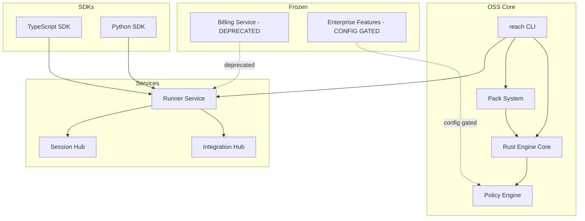
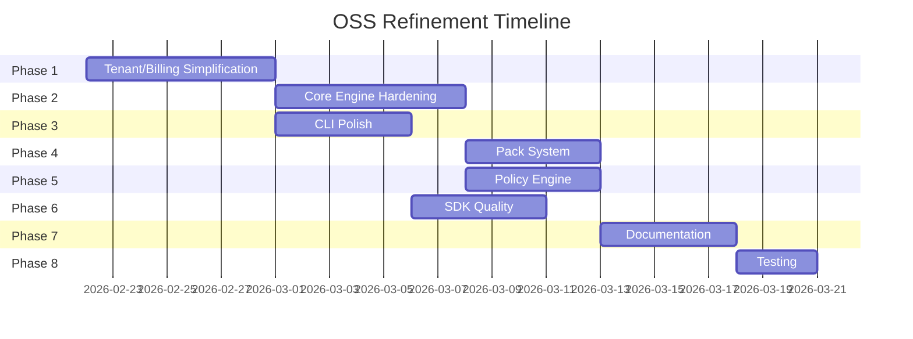

# ReadyLayer OSS Refinement Plan

**Status**: Planning
**Objective**: Shift focus from enterprise paid cloud to core engineering fundamentals and OSS excellence

---

## Executive Summary

This plan outlines a comprehensive refinement of ReadyLayer's core components to deliver a polished, production-ready OSS offering. The enterprise billing and multi-tenant features will be preserved but deprecated, with all features gated behind configuration flags rather than payment tiers.

---

## Architecture Overview



---

## Phase 1: Simplify Tenant/Billing Architecture

### Goal
Preserve billing code but mark as deprecated, simplify tenant to single default, gate enterprise features behind config flags.

### Tasks

#### 1.1 Billing Service Deprecation
- [ ] Add `// Deprecated: Enterprise billing is frozen. Use OSS defaults.` comments to all billing package exports
- [ ] Create `DEPRECATED.md` in `services/billing/` explaining the freeze
- [ ] Update `services/billing/internal/billing/plan.go` to default to Free tier with all features enabled
- [ ] Update `services/billing/tier/tier.go` to allow all features regardless of plan

#### 1.2 Tenant Simplification
- [ ] Create `DEFAULT_TENANT = "default"` constant in `services/runner/internal/contextkeys/keys.go`
- [ ] Update all API handlers to use default tenant when `X-Tenant-ID` header is missing
- [ ] Modify `services/runner/internal/storage/storage.go` to auto-populate tenant_id with default
- [ ] Update session middleware to create sessions with default tenant

#### 1.3 Enterprise Feature Gates
- [ ] Create `internal/config/features.go` with feature flags:
  ```go
  type FeatureFlags struct {
      EnableSSO             bool `json:"enable_sso"`
      EnableComplianceLogs  bool `json:"enable_compliance_logs"`
      EnableNodeFederation  bool `json:"enable_node_federation"`
      EnableUnlimitedSpawns bool `json:"enable_unlimited_spawns"`
  }
  ```
- [ ] Add `REACH_FEATURE_FLAGS` environment variable support
- [ ] Update feature checks to use config flags instead of billing tier
- [ ] Document feature flag configuration in `docs/CONFIG.md`

#### 1.4 Integration Updates
- [ ] Update `services/integration-hub` to use default tenant
- [ ] Update `services/session-hub` to use default tenant
- [ ] Update `services/capsule-sync` to use default tenant
- [ ] Update `services/connector-registry` to use default tenant

---

## Phase 2: Core Engine Hardening

### Goal
Ensure the Rust deterministic engine is bulletproof with comprehensive invariants and replay verification.

### Tasks

#### 2.1 Invariant Expansion
- [ ] Add replay integrity invariant: `replay_produces_identical_merkle_root`
- [ ] Add budget enforcement invariant: `budget_gate_prevents_overspend`
- [ ] Add policy enforcement invariant: `policy_gate_blocks_undeclared_tools`
- [ ] Add signature verification invariant: `signed_pack_verifies_canonical_hash`
- [ ] Create property-based tests for all invariants using `proptest`

#### 2.2 Engine Test Coverage
- [ ] Achieve 100% coverage on `crates/engine-core/src/lib.rs`
- [ ] Achieve 100% coverage on `crates/engine-core/src/invariants/mod.rs`
- [ ] Add chaos tests for replay under failure conditions
- [ ] Add version compatibility tests for forward/backward compatibility

#### 2.3 FFI Layer Hardening
- [ ] Audit `crates/ffi/c_abi/src/lib.rs` for memory safety
- [ ] Audit `crates/ffi/uniffi/src/lib.rs` for panic safety
- [ ] Add comprehensive error handling for FFI boundary
- [ ] Document FFI contract in `protocol/README.md`

#### 2.4 Performance Validation
- [ ] Add benchmark suite for core operations
- [ ] Establish performance baselines in CI
- [ ] Add regression detection for performance degradation

---

## Phase 3: CLI Experience Polish

### Goal
Make the `reach` CLI the gold standard for local-first agent reliability tooling.

### Tasks

#### 3.1 Command Consistency
- [ ] Audit all CLI commands for consistent flag naming
- [ ] Ensure all commands support `--json` output
- [ ] Ensure all commands support `--quiet` mode
- [ ] Add `--help` examples to all commands

#### 3.2 Error Messages
- [ ] Audit all error messages for clarity and actionability
- [ ] Add error codes to all errors (reference `docs/ERROR_CODES.md`)
- [ ] Add suggested fixes to common errors
- [ ] Create `reach doctor` checks for common issues

#### 3.3 Progress & Feedback
- [ ] Add progress indicators for long-running operations
- [ ] Add verbose logging with `--verbose` flag
- [ ] Add timing information for operations
- [ ] Add summary output for batch operations

#### 3.4 Local-First Workflow
- [ ] Ensure all core workflows work without network
- [ ] Add offline mode detection and graceful degradation
- [ ] Cache pack signatures locally for offline verification
- [ ] Document local-first architecture in `docs/EDGE_MODE.md`

---

## Phase 4: Pack System Refinement

### Goal
Make pack creation, validation, and distribution seamless and reliable.

### Tasks

#### 4.1 Pack Validation
- [ ] Implement comprehensive schema validation in `pack-devkit/harness/`
- [ ] Add lint rules for pack best practices
- [ ] Add security audit for pack permissions
- [ ] Create `reach pack validate` command

#### 4.2 Pack Signing
- [ ] Document signing workflow in `PLUGIN_SIGNING.md`
- [ ] Add key generation command: `reach key generate`
- [ ] Add key management: `reach key list`, `reach key import`, `reach key export`
- [ ] Add signature verification: `reach pack verify`

#### 4.3 Pack Distribution
- [ ] Simplify pack registry to file-based or git-based
- [ ] Add `reach pack publish` for local/registry publishing
- [ ] Add `reach pack search` for discovering packs
- [ ] Add `reach pack install` for local installation

#### 4.4 Pack Templates
- [ ] Create starter templates in `examples/packs/`
- [ ] Add `reach pack init` command for creating new packs
- [ ] Document pack structure in `docs/PACK_TEMPLATES.md`
- [ ] Add example packs for common use cases

---

## Phase 5: Policy Engine Clarity

### Goal
Make policy definition and enforcement transparent and auditable.

### Tasks

#### 5.1 Policy Definition
- [ ] Document policy schema in `protocol/schemas/policy-bundle.schema.json`
- [ ] Create policy examples in `policies/`
- [ ] Add `reach policy lint` command
- [ ] Add `reach policy explain` command for transparency

#### 5.2 Policy Enforcement
- [ ] Audit all policy gates for consistent behavior
- [ ] Add detailed logging for policy decisions
- [ ] Add audit trail for policy changes
- [ ] Document policy enforcement in `docs/POLICY_GATE.md`

#### 5.3 Policy Testing
- [ ] Create policy test harness
- [ ] Add `reach policy test` command
- [ ] Add policy coverage reporting
- [ ] Document policy testing in `docs/testing-smoke.md`

---

## Phase 6: SDK Quality Pass

### Goal
Make the TypeScript and Python SDKs delightful to use.

### Tasks

#### 6.1 TypeScript SDK
- [ ] Audit `sdk/ts/src/index.ts` for API consistency
- [ ] Add comprehensive JSDoc comments
- [ ] Add TypeScript strict mode compliance
- [ ] Add integration tests with real runner

#### 6.2 Python SDK
- [ ] Audit `sdk/python/reach_sdk/` for API consistency
- [ ] Add comprehensive docstrings
- [ ] Add type hints throughout
- [ ] Add integration tests with real runner

#### 6.3 SDK Documentation
- [ ] Create `sdk/ts/README.md` with examples
- [ ] Create `sdk/python/README.md` with examples
- [ ] Add SDK reference to main documentation
- [ ] Add SDK quickstart guide

#### 6.4 SDK Examples
- [ ] Add `examples/ts-basic/` improvements
- [ ] Add `examples/python-basic/` improvements
- [ ] Add `examples/express-basic/` improvements
- [ ] Add `examples/fastapi-basic/` improvements

---

## Phase 7: Documentation Accuracy

### Goal
Ensure all documentation is accurate, complete, and up-to-date.

### Tasks

#### 7.1 Documentation Audit
- [ ] Audit all docs for accuracy against current code
- [ ] Remove outdated enterprise-focused content
- [ ] Update architecture diagrams
- [ ] Fix broken links and references

#### 7.2 Getting Started
- [ ] Simplify `README.md` for OSS audience
- [ ] Update `docs/QUICKSTART_TECH.md`
- [ ] Update `docs/QUICKSTART_NON_TECH.md`
- [ ] Create 5-minute getting started guide

#### 7.3 API Documentation
- [ ] Update `openapi/reach.openapi.yaml`
- [ ] Generate API reference from OpenAPI spec
- [ ] Add examples to all endpoints
- [ ] Document error responses

#### 7.4 Architecture Documentation
- [ ] Update `docs/ARCHITECTURE.md`
- [ ] Update `docs/EXECUTION_MODEL.md`
- [ ] Update `docs/EVENT_MODEL.md`
- [ ] Create component interaction diagrams

---

## Phase 8: Testing & Verification

### Goal
Ensure everything works correctly and reliably.

### Tasks

#### 8.1 Test Suite
- [ ] Run full test suite: `npm run verify:full`
- [ ] Fix any failing tests
- [ ] Add missing test coverage
- [ ] Add integration tests for OSS workflows

#### 8.2 Smoke Tests
- [ ] Run `scripts/smoke-test.sh`
- [ ] Update smoke tests for OSS scenarios
- [ ] Add smoke tests for CLI commands
- [ ] Add smoke tests for SDK operations

#### 8.3 CI/CD
- [ ] Update `.github/workflows/` for OSS focus
- [ ] Remove enterprise-specific CI jobs
- [ ] Add OSS-specific CI validations
- [ ] Ensure all checks pass

#### 8.4 Release Verification
- [ ] Run `./reach release-check`
- [ ] Run `./reach doctor`
- [ ] Verify local installation works
- [ ] Verify Docker deployment works

---

## Migration Guide

For users currently using enterprise features:

### Feature Flag Migration
```bash
# Enable previously enterprise-only features
export REACH_FEATURE_FLAGS='{"enable_sso":true,"enable_compliance_logs":true}'
```

### Tenant Migration
All existing tenant-scoped data will be migrated to the default tenant. The `tenant_id` field is preserved in all APIs for backward compatibility but defaults to `"default"`.

### Billing Migration
The billing service is frozen but preserved. No action required for OSS users. Enterprise users should contact support for migration options.

---

## Success Criteria

1. **All tests pass** - `npm run verify:full` completes with zero errors
2. **CLI works locally** - All `reach` commands work without network access
3. **Documentation accurate** - All docs reflect current code behavior
4. **SDKs functional** - Both TypeScript and Python SDKs work with local runner
5. **Packs verifiable** - Pack signing and verification works end-to-end
6. **Policy transparent** - Policy decisions are logged and explainable

---

## Timeline

This plan is designed to be executed incrementally. Each phase can be completed independently and merged when ready.



---

## Notes

- All changes should maintain backward compatibility where possible
- Breaking changes require migration guides
- All deprecations should be documented with timeline
- Feature flags should be documented and tested

**Status**: Planning
**Objective**: Shift focus from enterprise paid cloud to core engineering fundamentals and OSS excellence

---

## Executive Summary

This plan outlines a comprehensive refinement of ReadyLayer's core components to deliver a polished, production-ready OSS offering. The enterprise billing and multi-tenant features will be preserved but deprecated, with all features gated behind configuration flags rather than payment tiers.

---

## Architecture Overview


---

## Phase 1: Simplify Tenant/Billing Architecture

### Goal
Preserve billing code but mark as deprecated, simplify tenant to single default, gate enterprise features behind config flags.

### Tasks

#### 1.1 Billing Service Deprecation
- [ ] Add `// Deprecated: Enterprise billing is frozen. Use OSS defaults.` comments to all billing package exports
- [ ] Create `DEPRECATED.md` in `services/billing/` explaining the freeze
- [ ] Update `services/billing/internal/billing/plan.go` to default to Free tier with all features enabled
- [ ] Update `services/billing/tier/tier.go` to allow all features regardless of plan

#### 1.2 Tenant Simplification
- [ ] Create `DEFAULT_TENANT = "default"` constant in `services/runner/internal/contextkeys/keys.go`
- [ ] Update all API handlers to use default tenant when `X-Tenant-ID` header is missing
- [ ] Modify `services/runner/internal/storage/storage.go` to auto-populate tenant_id with default
- [ ] Update session middleware to create sessions with default tenant

#### 1.3 Enterprise Feature Gates
- [ ] Create `internal/config/features.go` with feature flags:
  ```go
  type FeatureFlags struct {
      EnableSSO             bool `json:"enable_sso"`
      EnableComplianceLogs  bool `json:"enable_compliance_logs"`
      EnableNodeFederation  bool `json:"enable_node_federation"`
      EnableUnlimitedSpawns bool `json:"enable_unlimited_spawns"`
  }
  ```
- [ ] Add `REACH_FEATURE_FLAGS` environment variable support
- [ ] Update feature checks to use config flags instead of billing tier
- [ ] Document feature flag configuration in `docs/CONFIG.md`

#### 1.4 Integration Updates
- [ ] Update `services/integration-hub` to use default tenant
- [ ] Update `services/session-hub` to use default tenant
- [ ] Update `services/capsule-sync` to use default tenant
- [ ] Update `services/connector-registry` to use default tenant

---

## Phase 2: Core Engine Hardening

### Goal
Ensure the Rust deterministic engine is bulletproof with comprehensive invariants and replay verification.

### Tasks

#### 2.1 Invariant Expansion
- [ ] Add replay integrity invariant: `replay_produces_identical_merkle_root`
- [ ] Add budget enforcement invariant: `budget_gate_prevents_overspend`
- [ ] Add policy enforcement invariant: `policy_gate_blocks_undeclared_tools`
- [ ] Add signature verification invariant: `signed_pack_verifies_canonical_hash`
- [ ] Create property-based tests for all invariants using `proptest`

#### 2.2 Engine Test Coverage
- [ ] Achieve 100% coverage on `crates/engine-core/src/lib.rs`
- [ ] Achieve 100% coverage on `crates/engine-core/src/invariants/mod.rs`
- [ ] Add chaos tests for replay under failure conditions
- [ ] Add version compatibility tests for forward/backward compatibility

#### 2.3 FFI Layer Hardening
- [ ] Audit `crates/ffi/c_abi/src/lib.rs` for memory safety
- [ ] Audit `crates/ffi/uniffi/src/lib.rs` for panic safety
- [ ] Add comprehensive error handling for FFI boundary
- [ ] Document FFI contract in `protocol/README.md`

#### 2.4 Performance Validation
- [ ] Add benchmark suite for core operations
- [ ] Establish performance baselines in CI
- [ ] Add regression detection for performance degradation

---

## Phase 3: CLI Experience Polish

### Goal
Make the `reach` CLI the gold standard for local-first agent reliability tooling.

### Tasks

#### 3.1 Command Consistency
- [ ] Audit all CLI commands for consistent flag naming
- [ ] Ensure all commands support `--json` output
- [ ] Ensure all commands support `--quiet` mode
- [ ] Add `--help` examples to all commands

#### 3.2 Error Messages
- [ ] Audit all error messages for clarity and actionability
- [ ] Add error codes to all errors (reference `docs/ERROR_CODES.md`)
- [ ] Add suggested fixes to common errors
- [ ] Create `reach doctor` checks for common issues

#### 3.3 Progress & Feedback
- [ ] Add progress indicators for long-running operations
- [ ] Add verbose logging with `--verbose` flag
- [ ] Add timing information for operations
- [ ] Add summary output for batch operations

#### 3.4 Local-First Workflow
- [ ] Ensure all core workflows work without network
- [ ] Add offline mode detection and graceful degradation
- [ ] Cache pack signatures locally for offline verification
- [ ] Document local-first architecture in `docs/EDGE_MODE.md`

---

## Phase 4: Pack System Refinement

### Goal
Make pack creation, validation, and distribution seamless and reliable.

### Tasks

#### 4.1 Pack Validation
- [ ] Implement comprehensive schema validation in `pack-devkit/harness/`
- [ ] Add lint rules for pack best practices
- [ ] Add security audit for pack permissions
- [ ] Create `reach pack validate` command

#### 4.2 Pack Signing
- [ ] Document signing workflow in `PLUGIN_SIGNING.md`
- [ ] Add key generation command: `reach key generate`
- [ ] Add key management: `reach key list`, `reach key import`, `reach key export`
- [ ] Add signature verification: `reach pack verify`

#### 4.3 Pack Distribution
- [ ] Simplify pack registry to file-based or git-based
- [ ] Add `reach pack publish` for local/registry publishing
- [ ] Add `reach pack search` for discovering packs
- [ ] Add `reach pack install` for local installation

#### 4.4 Pack Templates
- [ ] Create starter templates in `examples/packs/`
- [ ] Add `reach pack init` command for creating new packs
- [ ] Document pack structure in `docs/PACK_TEMPLATES.md`
- [ ] Add example packs for common use cases

---

## Phase 5: Policy Engine Clarity

### Goal
Make policy definition and enforcement transparent and auditable.

### Tasks

#### 5.1 Policy Definition
- [ ] Document policy schema in `protocol/schemas/policy-bundle.schema.json`
- [ ] Create policy examples in `policies/`
- [ ] Add `reach policy lint` command
- [ ] Add `reach policy explain` command for transparency

#### 5.2 Policy Enforcement
- [ ] Audit all policy gates for consistent behavior
- [ ] Add detailed logging for policy decisions
- [ ] Add audit trail for policy changes
- [ ] Document policy enforcement in `docs/POLICY_GATE.md`

#### 5.3 Policy Testing
- [ ] Create policy test harness
- [ ] Add `reach policy test` command
- [ ] Add policy coverage reporting
- [ ] Document policy testing in `docs/testing-smoke.md`

---

## Phase 6: SDK Quality Pass

### Goal
Make the TypeScript and Python SDKs delightful to use.

### Tasks

#### 6.1 TypeScript SDK
- [ ] Audit `sdk/ts/src/index.ts` for API consistency
- [ ] Add comprehensive JSDoc comments
- [ ] Add TypeScript strict mode compliance
- [ ] Add integration tests with real runner

#### 6.2 Python SDK
- [ ] Audit `sdk/python/reach_sdk/` for API consistency
- [ ] Add comprehensive docstrings
- [ ] Add type hints throughout
- [ ] Add integration tests with real runner

#### 6.3 SDK Documentation
- [ ] Create `sdk/ts/README.md` with examples
- [ ] Create `sdk/python/README.md` with examples
- [ ] Add SDK reference to main documentation
- [ ] Add SDK quickstart guide

#### 6.4 SDK Examples
- [ ] Add `examples/ts-basic/` improvements
- [ ] Add `examples/python-basic/` improvements
- [ ] Add `examples/express-basic/` improvements
- [ ] Add `examples/fastapi-basic/` improvements

---

## Phase 7: Documentation Accuracy

### Goal
Ensure all documentation is accurate, complete, and up-to-date.

### Tasks

#### 7.1 Documentation Audit
- [ ] Audit all docs for accuracy against current code
- [ ] Remove outdated enterprise-focused content
- [ ] Update architecture diagrams
- [ ] Fix broken links and references

#### 7.2 Getting Started
- [ ] Simplify `README.md` for OSS audience
- [ ] Update `docs/QUICKSTART_TECH.md`
- [ ] Update `docs/QUICKSTART_NON_TECH.md`
- [ ] Create 5-minute getting started guide

#### 7.3 API Documentation
- [ ] Update `openapi/reach.openapi.yaml`
- [ ] Generate API reference from OpenAPI spec
- [ ] Add examples to all endpoints
- [ ] Document error responses

#### 7.4 Architecture Documentation
- [ ] Update `docs/ARCHITECTURE.md`
- [ ] Update `docs/EXECUTION_MODEL.md`
- [ ] Update `docs/EVENT_MODEL.md`
- [ ] Create component interaction diagrams

---

## Phase 8: Testing & Verification

### Goal
Ensure everything works correctly and reliably.

### Tasks

#### 8.1 Test Suite
- [ ] Run full test suite: `npm run verify:full`
- [ ] Fix any failing tests
- [ ] Add missing test coverage
- [ ] Add integration tests for OSS workflows

#### 8.2 Smoke Tests
- [ ] Run `scripts/smoke-test.sh`
- [ ] Update smoke tests for OSS scenarios
- [ ] Add smoke tests for CLI commands
- [ ] Add smoke tests for SDK operations

#### 8.3 CI/CD
- [ ] Update `.github/workflows/` for OSS focus
- [ ] Remove enterprise-specific CI jobs
- [ ] Add OSS-specific CI validations
- [ ] Ensure all checks pass

#### 8.4 Release Verification
- [ ] Run `./reach release-check`
- [ ] Run `./reach doctor`
- [ ] Verify local installation works
- [ ] Verify Docker deployment works

---

## Migration Guide

For users currently using enterprise features:

### Feature Flag Migration
```bash
# Enable previously enterprise-only features
export REACH_FEATURE_FLAGS='{"enable_sso":true,"enable_compliance_logs":true}'
```

### Tenant Migration
All existing tenant-scoped data will be migrated to the default tenant. The `tenant_id` field is preserved in all APIs for backward compatibility but defaults to `"default"`.

### Billing Migration
The billing service is frozen but preserved. No action required for OSS users. Enterprise users should contact support for migration options.

---

## Success Criteria

1. **All tests pass** - `npm run verify:full` completes with zero errors
2. **CLI works locally** - All `reach` commands work without network access
3. **Documentation accurate** - All docs reflect current code behavior
4. **SDKs functional** - Both TypeScript and Python SDKs work with local runner
5. **Packs verifiable** - Pack signing and verification works end-to-end
6. **Policy transparent** - Policy decisions are logged and explainable

---

## Timeline

This plan is designed to be executed incrementally. Each phase can be completed independently and merged when ready.


---

## Notes

- All changes should maintain backward compatibility where possible
- Breaking changes require migration guides
- All deprecations should be documented with timeline
- Feature flags should be documented and tested

