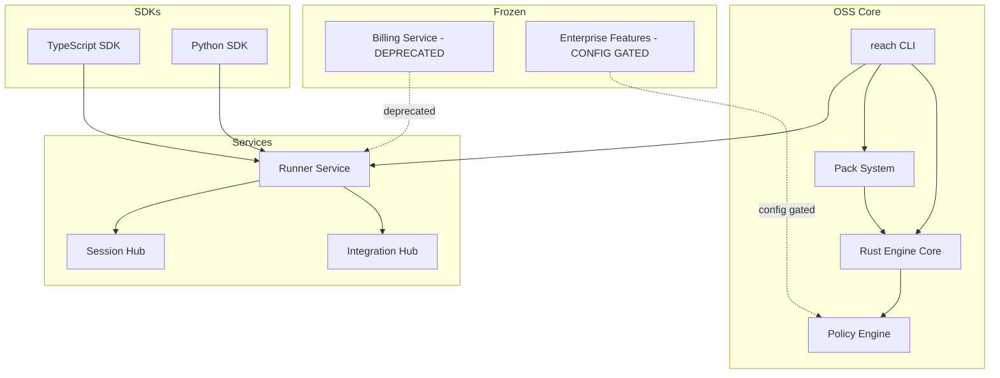
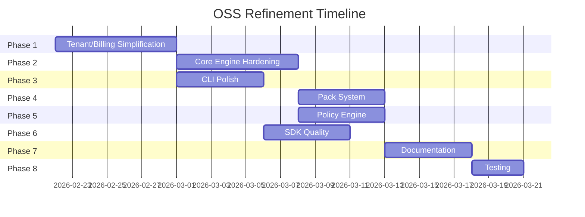
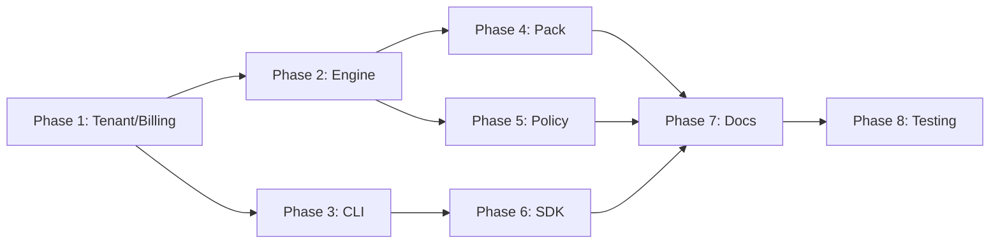

# ReadyLayer OSS Refinement Plan

**Status**: Planning  
**Last Updated**: 2026-02-22  
**Objective**: Shift focus from enterprise paid cloud to core engineering fundamentals and OSS excellence

---

## Executive Summary

This plan outlines a comprehensive refinement of ReadyLayer's core components to deliver a polished, production-ready OSS offering. The enterprise billing and multi-tenant features will be preserved but deprecated, with all features gated behind configuration flags rather than payment tiers.

### Key Principles

1. **Preserve, Don't Delete** - Billing code remains but marked deprecated
2. **Simplify, Don't Complexify** - Single default tenant throughout
3. **Configure, Don't Paywall** - Features gated by config flags, not billing
4. **Document, Don't Assume** - Clear migration paths and explanations

---

## Architecture Overview



### Component Status

| Component           | Status       | Notes                               |
| ------------------- | ------------ | ----------------------------------- |
| CLI                 | Active       | Primary user interface              |
| Engine Core         | Active       | Rust deterministic engine           |
| Policy Engine       | Active       | Policy enforcement                  |
| Pack System         | Active       | Plugin/pack management              |
| TypeScript SDK      | Active       | Node.js integration                 |
| Python SDK          | Active       | Python integration                  |
| Billing Service     | Frozen       | Deprecated, preserved for reference |
| Enterprise Features | Config-Gated | Enabled via feature flags           |

---

## Phase 1: Simplify Tenant/Billing Architecture

### Goal

Preserve billing code but mark as deprecated, simplify tenant to single default, gate enterprise features behind config flags.

### Tasks

#### 1.1 Billing Service Deprecation

- [ ] Add `// Deprecated: Enterprise billing is frozen. Use OSS defaults.` comments to all billing package exports
- [ ] Create `DEPRECATED.md` in `services/billing/` explaining the freeze
- [ ] Update [`services/billing/internal/billing/plan.go`](services/billing/internal/billing/plan.go) to default to Free tier with all features enabled
- [ ] Update [`services/billing/tier/tier.go`](services/billing/tier/tier.go) to allow all features regardless of plan
- [ ] Add build tags to exclude billing from default builds

#### 1.2 Tenant Simplification

- [ ] Create `DEFAULT_TENANT = "default"` constant in [`services/runner/internal/contextkeys/keys.go`](services/runner/internal/contextkeys/keys.go)
- [ ] Update all API handlers to use default tenant when `X-Tenant-ID` header is missing
- [ ] Modify [`services/runner/internal/storage/storage.go`](services/runner/internal/storage/storage.go) to auto-populate tenant_id with default
- [ ] Update session middleware to create sessions with default tenant
- [ ] Add migration script for existing multi-tenant data

#### 1.3 Enterprise Feature Gates

- [ ] Create [`internal/config/features.go`](internal/config/features.go) with feature flags:

  ```go
  // FeatureFlags controls availability of enterprise-grade features.
  // All features are available in OSS via configuration.
  type FeatureFlags struct {
      EnableSSO             bool `json:"enable_sso" env:"REACH_ENABLE_SSO"`
      EnableComplianceLogs  bool `json:"enable_compliance_logs" env:"REACH_ENABLE_COMPLIANCE_LOGS"`
      EnableNodeFederation  bool `json:"enable_node_federation" env:"REACH_ENABLE_NODE_FEDERATION"`
      EnableUnlimitedSpawns bool `json:"enable_unlimited_spawns" env:"REACH_ENABLE_UNLIMITED_SPAWNS"`
      EnableAuditTrail      bool `json:"enable_audit_trail" env:"REACH_ENABLE_AUDIT_TRAIL"`
      EnableAdvancedMetrics bool `json:"enable_advanced_metrics" env:"REACH_ENABLE_ADVANCED_METRICS"`
  }

  // DefaultFeatureFlags returns the default OSS configuration.
  func DefaultFeatureFlags() FeatureFlags {
      return FeatureFlags{
          EnableSSO:             false,
          EnableComplianceLogs:  false,
          EnableNodeFederation:  false,
          EnableUnlimitedSpawns: true,  // OSS default: unlimited
          EnableAuditTrail:      true,  // OSS default: enabled
          EnableAdvancedMetrics: false,
      }
  }
  ```

- [ ] Add `REACH_FEATURE_FLAGS` environment variable support (JSON format)
- [ ] Add individual `REACH_ENABLE_*` environment variable support
- [ ] Update feature checks to use config flags instead of billing tier
- [ ] Document feature flag configuration in [`docs/CONFIG.md`](docs/CONFIG.md)

#### 1.4 Integration Updates

- [ ] Update [`services/integration-hub`](services/integration-hub) to use default tenant
- [ ] Update [`services/session-hub`](services/session-hub) to use default tenant
- [ ] Update [`services/capsule-sync`](services/capsule-sync) to use default tenant
- [ ] Update [`services/connector-registry`](services/connector-registry) to use default tenant

### Success Criteria - Phase 1

- [ ] All billing code has deprecation notices
- [ ] Single tenant mode works without tenant headers
- [ ] Feature flags can enable/disable enterprise features
- [ ] All services work with default tenant

---

## Phase 2: Core Engine Hardening

### Goal

Ensure the Rust deterministic engine is bulletproof with comprehensive invariants and replay verification.

### Tasks

#### 2.1 Invariant Expansion

- [ ] Add replay integrity invariant: `replay_produces_identical_merkle_root`
  ```rust
  /// Invariant: Replaying the same event sequence produces an identical Merkle root.
  /// This ensures deterministic execution across all nodes.
  #[cfg(test)]
  proptest! {
      fn replay_produces_identical_merkle_root(events in arb_event_sequence()) {
          let engine = Engine::new();
          let root1 = engine.replay(&events).unwrap().merkle_root();
          let root2 = engine.replay(&events).unwrap().merkle_root();
          prop_assert_eq!(root1, root2);
      }
  }
  ```
- [ ] Add budget enforcement invariant: `budget_gate_prevents_overspend`
- [ ] Add policy enforcement invariant: `policy_gate_blocks_undeclared_tools`
- [ ] Add signature verification invariant: `signed_pack_verifies_canonical_hash`
- [ ] Add spawn isolation invariant: `spawn_failures_isolate_to_originator`
- [ ] Create property-based tests for all invariants using `proptest`

#### 2.2 Engine Test Coverage

- [ ] Achieve 100% coverage on [`crates/engine-core/src/lib.rs`](crates/engine-core/src/lib.rs)
- [ ] Achieve 100% coverage on [`crates/engine-core/src/invariants/mod.rs`](crates/engine-core/src/invariants/mod.rs)
- [ ] Add chaos tests for replay under failure conditions
- [ ] Add version compatibility tests for forward/backward compatibility
- [ ] Add fuzz testing for input validation

#### 2.3 FFI Layer Hardening

- [ ] Audit [`crates/ffi/c_abi/src/lib.rs`](crates/ffi/c_abi/src/lib.rs) for memory safety
- [ ] Audit [`crates/ffi/uniffi/src/lib.rs`](crates/ffi/uniffi/src/lib.rs) for panic safety
- [ ] Add comprehensive error handling for FFI boundary
- [ ] Document FFI contract in [`protocol/README.md`](protocol/README.md)
- [ ] Add sanitizers (ASan, MSan) to CI

#### 2.4 Performance Validation

- [ ] Add benchmark suite for core operations
- [ ] Establish performance baselines in CI
- [ ] Add regression detection for performance degradation
- [ ] Document performance characteristics

### Success Criteria - Phase 2

- [ ] All invariants have property-based tests
- [ ] 100% test coverage on core engine files
- [ ] FFI layer passes memory safety audit
- [ ] Performance baselines established

---

## Phase 3: CLI Experience Polish

### Goal

Make the `reach` CLI the gold standard for local-first agent reliability tooling.

### Tasks

#### 3.1 Command Consistency

- [ ] Audit all CLI commands for consistent flag naming
- [ ] Ensure all commands support `--json` output
- [ ] Ensure all commands support `--quiet` mode
- [ ] Add `--help` examples to all commands
- [ ] Create CLI style guide document

#### 3.2 Error Messages

- [ ] Audit all error messages for clarity and actionability
- [ ] Add error codes to all errors (reference [`docs/ERROR_CODES.md`](docs/ERROR_CODES.md))
- [ ] Add suggested fixes to common errors
- [ ] Create `reach doctor` checks for common issues
- [ ] Add error message templates for consistency

#### 3.3 Progress & Feedback

- [ ] Add progress indicators for long-running operations
- [ ] Add verbose logging with `--verbose` flag
- [ ] Add timing information for operations
- [ ] Add summary output for batch operations
- [ ] Add color output with `--color` flag support

#### 3.4 Local-First Workflow

- [ ] Ensure all core workflows work without network
- [ ] Add offline mode detection and graceful degradation
- [ ] Cache pack signatures locally for offline verification
- [ ] Document local-first architecture in [`docs/EDGE_MODE.md`](docs/EDGE_MODE.md)
- [ ] Add `reach offline` command to check offline status

### Success Criteria - Phase 3

- [ ] All commands have consistent flags
- [ ] Error messages are actionable
- [ ] Progress indicators work for long operations
- [ ] Core workflows work offline

---

## Phase 4: Pack System Refinement

### Goal

Make pack creation, validation, and distribution seamless and reliable.

### Tasks

#### 4.1 Pack Validation

- [ ] Implement comprehensive schema validation in [`pack-devkit/harness/`](pack-devkit/harness/)
- [ ] Add lint rules for pack best practices
- [ ] Add security audit for pack permissions
- [ ] Create `reach pack validate` command
- [ ] Add pack compatibility checking

#### 4.2 Pack Signing

- [ ] Document signing workflow in [`PLUGIN_SIGNING.md`](PLUGIN_SIGNING.md)
- [ ] Add key generation command: `reach key generate`
- [ ] Add key management: `reach key list`, `reach key import`, `reach key export`
- [ ] Add signature verification: `reach pack verify`
- [ ] Add trust store management

#### 4.3 Pack Distribution

- [ ] Simplify pack registry to file-based or git-based
- [ ] Add `reach pack publish` for local/registry publishing
- [ ] Add `reach pack search` for discovering packs
- [ ] Add `reach pack install` for local installation
- [ ] Add `reach pack update` for updating installed packs

#### 4.4 Pack Templates

- [ ] Create starter templates in [`examples/packs/`](examples/packs/)
- [ ] Add `reach pack init` command for creating new packs
- [ ] Document pack structure in [`docs/PACK_TEMPLATES.md`](docs/PACK_TEMPLATES.md)
- [ ] Add example packs for common use cases:
  - [ ] `example-pack-basic` - Minimal pack template
  - [ ] `example-pack-connector` - Connector pack template
  - [ ] `example-pack-policy` - Policy pack template

### Success Criteria - Phase 4

- [ ] Pack validation catches all schema errors
- [ ] Pack signing workflow is documented
- [ ] Pack distribution works without external registry
- [ ] Pack templates are available for common use cases

---

## Phase 5: Policy Engine Clarity

### Goal

Make policy definition and enforcement transparent and auditable.

### Tasks

#### 5.1 Policy Definition

- [ ] Document policy schema in [`protocol/schemas/policy-bundle.schema.json`](protocol/schemas/policy-bundle.schema.json)
- [ ] Create policy examples in [`policies/`](policies/)
- [ ] Add `reach policy lint` command
- [ ] Add `reach policy explain` command for transparency
- [ ] Create policy language reference

#### 5.2 Policy Enforcement

- [ ] Audit all policy gates for consistent behavior
- [ ] Add detailed logging for policy decisions
- [ ] Add audit trail for policy changes
- [ ] Document policy enforcement in [`docs/POLICY_GATE.md`](docs/POLICY_GATE.md)
- [ ] Add policy decision explanations in responses

#### 5.3 Policy Testing

- [ ] Create policy test harness
- [ ] Add `reach policy test` command
- [ ] Add policy coverage reporting
- [ ] Document policy testing in [`docs/testing-smoke.md`](docs/testing-smoke.md)
- [ ] Add policy regression tests

### Success Criteria - Phase 5

- [ ] Policy schema is fully documented
- [ ] Policy decisions are logged and explainable
- [ ] Policy testing is automated
- [ ] Policy examples cover common use cases

---

## Phase 6: SDK Quality Pass

### Goal

Make the TypeScript and Python SDKs delightful to use.

### Tasks

#### 6.1 TypeScript SDK

- [ ] Audit [`sdk/ts/src/index.ts`](sdk/ts/src/index.ts) for API consistency
- [ ] Add comprehensive JSDoc comments
- [ ] Add TypeScript strict mode compliance
- [ ] Add integration tests with real runner
- [ ] Add tree-shaking support

#### 6.2 Python SDK

- [ ] Audit [`sdk/python/reach_sdk/`](sdk/python/reach_sdk/) for API consistency
- [ ] Add comprehensive docstrings
- [ ] Add type hints throughout
- [ ] Add integration tests with real runner
- [ ] Add async support

#### 6.3 SDK Documentation

- [ ] Create [`sdk/ts/README.md`](sdk/ts/README.md) with examples
- [ ] Create [`sdk/python/README.md`](sdk/python/README.md) with examples
- [ ] Add SDK reference to main documentation
- [ ] Add SDK quickstart guide
- [ ] Add SDK migration guide

#### 6.4 SDK Examples

- [ ] Add [`examples/ts-basic/`](examples/ts-basic/) improvements
- [ ] Add [`examples/python-basic/`](examples/python-basic/) improvements
- [ ] Add [`examples/express-basic/`](examples/express-basic/) improvements
- [ ] Add [`examples/fastapi-basic/`](examples/fastapi-basic/) improvements
- [ ] Add [`examples/nextjs-basic/`](examples/nextjs-basic/) example

### Success Criteria - Phase 6

- [ ] TypeScript SDK has 100% type coverage
- [ ] Python SDK has complete type hints
- [ ] SDK documentation is comprehensive
- [ ] SDK examples work out of the box

---

## Phase 7: Documentation Accuracy

### Goal

Ensure all documentation is accurate, complete, and up-to-date.

### Tasks

#### 7.1 Documentation Audit

- [ ] Audit all docs for accuracy against current code
- [ ] Remove outdated enterprise-focused content
- [ ] Update architecture diagrams
- [ ] Fix broken links and references
- [ ] Add documentation linting to CI

#### 7.2 Getting Started

- [ ] Simplify [`README.md`](README.md) for OSS audience
- [ ] Update [`docs/QUICKSTART_TECH.md`](docs/QUICKSTART_TECH.md)
- [ ] Update [`docs/QUICKSTART_NON_TECH.md`](docs/QUICKSTART_NON_TECH.md)
- [ ] Create 5-minute getting started guide
- [ ] Add interactive tutorial

#### 7.3 API Documentation

- [ ] Update [`openapi/reach.openapi.yaml`](openapi/reach.openapi.yaml)
- [ ] Generate API reference from OpenAPI spec
- [ ] Add examples to all endpoints
- [ ] Document error responses
- [ ] Add API versioning documentation

#### 7.4 Architecture Documentation

- [ ] Update [`docs/ARCHITECTURE.md`](docs/ARCHITECTURE.md)
- [ ] Update [`docs/EXECUTION_MODEL.md`](docs/EXECUTION_MODEL.md)
- [ ] Update [`docs/EVENT_MODEL.md`](docs/EVENT_MODEL.md)
- [ ] Create component interaction diagrams
- [ ] Add decision records (ADRs)

### Success Criteria - Phase 7

- [ ] All documentation is accurate
- [ ] Getting started guide works for new users
- [ ] API documentation is complete
- [ ] Architecture is well documented

---

## Phase 8: Testing & Verification

### Goal

Ensure everything works correctly and reliably.

### Tasks

#### 8.1 Test Suite

- [ ] Run full test suite: `npm run verify:full`
- [ ] Fix any failing tests
- [ ] Add missing test coverage
- [ ] Add integration tests for OSS workflows
- [ ] Add end-to-end tests

#### 8.2 Smoke Tests

- [ ] Run [`scripts/smoke-test.sh`](scripts/smoke-test.sh)
- [ ] Update smoke tests for OSS scenarios
- [ ] Add smoke tests for CLI commands
- [ ] Add smoke tests for SDK operations
- [ ] Add smoke tests for pack operations

#### 8.3 CI/CD

- [ ] Update `.github/workflows/` for OSS focus
- [ ] Remove enterprise-specific CI jobs
- [ ] Add OSS-specific CI validations
- [ ] Ensure all checks pass
- [ ] Add release automation

#### 8.4 Release Verification

- [ ] Run `./reach release-check`
- [ ] Run `./reach doctor`
- [ ] Verify local installation works
- [ ] Verify Docker deployment works
- [ ] Verify upgrade path works

### Success Criteria - Phase 8

- [ ] All tests pass
- [ ] Smoke tests cover all workflows
- [ ] CI/CD is streamlined for OSS
- [ ] Release process is documented

---

## Migration Guide

For users currently using enterprise features:

### Feature Flag Migration

Previously enterprise-only features are now available via configuration:

```bash
# Enable all enterprise features
export REACH_FEATURE_FLAGS='{"enable_sso":true,"enable_compliance_logs":true,"enable_node_federation":true}'

# Or enable individual features
export REACH_ENABLE_SSO=true
export REACH_ENABLE_COMPLIANCE_LOGS=true
export REACH_ENABLE_NODE_FEDERATION=true
```

### Tenant Migration

All existing tenant-scoped data will be migrated to the default tenant:

```sql
-- Migration script (run before upgrade)
UPDATE sessions SET tenant_id = 'default' WHERE tenant_id IS NULL;
UPDATE capsules SET tenant_id = 'default' WHERE tenant_id IS NULL;
```

The `tenant_id` field is preserved in all APIs for backward compatibility but defaults to `"default"`.

### Billing Migration

The billing service is frozen but preserved. No action required for OSS users. Enterprise users should:

1. Export any billing data before upgrade
2. Remove billing service from deployment
3. Enable features via feature flags instead

### API Changes

| Endpoint               | Change       | Migration                |
| ---------------------- | ------------ | ------------------------ |
| `X-Tenant-ID` header   | Optional     | Remove or leave empty    |
| `/billing/*` endpoints | Deprecated   | Remove from integrations |
| Feature checks         | Config-based | Use feature flags        |

---

## Success Criteria

### Must Have

1. **All tests pass** - `npm run verify:full` completes with zero errors
2. **CLI works locally** - All `reach` commands work without network access
3. **Documentation accurate** - All docs reflect current code behavior
4. **SDKs functional** - Both TypeScript and Python SDKs work with local runner

### Should Have

5. **Packs verifiable** - Pack signing and verification works end-to-end
6. **Policy transparent** - Policy decisions are logged and explainable
7. **Performance validated** - Benchmarks established and passing

### Nice to Have

8. **Interactive tutorial** - New users can learn in 5 minutes
9. **Example gallery** - Common use cases have working examples
10. **Video walkthroughs** - Key workflows have video guides

---

## Timeline

This plan is designed to be executed incrementally. Each phase can be completed independently and merged when ready.



### Dependencies



---

## Risk Assessment

| Risk                           | Impact | Mitigation                                               |
| ------------------------------ | ------ | -------------------------------------------------------- |
| Breaking existing integrations | High   | Maintain backward compatibility, provide migration guide |
| Performance regression         | Medium | Establish baselines, add regression detection            |
| Documentation drift            | Medium | Add doc linting to CI, require doc updates in PRs        |
| Test coverage gaps             | Medium | Add coverage reporting, require tests for changes        |
| Feature flag complexity        | Low    | Clear documentation, sensible defaults                   |

---

## Notes

- All changes should maintain backward compatibility where possible
- Breaking changes require migration guides
- All deprecations should be documented with timeline
- Feature flags should be documented and tested
- Each phase should be mergeable independently

---

## Appendix: File Reference

### Key Files to Modify

| File                                         | Phase | Purpose                 |
| -------------------------------------------- | ----- | ----------------------- |
| `services/billing/**/*.go`                   | 1     | Add deprecation notices |
| `internal/config/features.go`                | 1     | Feature flag system     |
| `crates/engine-core/src/invariants/mod.rs`   | 2     | Invariant expansion     |
| `reach` (CLI)                                | 3     | CLI improvements        |
| `pack-devkit/harness/`                       | 4     | Pack validation         |
| `protocol/schemas/policy-bundle.schema.json` | 5     | Policy schema           |
| `sdk/ts/src/index.ts`                        | 6     | TypeScript SDK          |
| `sdk/python/reach_sdk/`                      | 6     | Python SDK              |
| `docs/**/*.md`                               | 7     | Documentation updates   |
| `.github/workflows/`                         | 8     | CI/CD updates           |

### Key Files to Create

| File                                 | Phase | Purpose             |
| ------------------------------------ | ----- | ------------------- |
| `services/billing/DEPRECATED.md`     | 1     | Deprecation notice  |
| `internal/config/features.go`        | 1     | Feature flags       |
| `docs/FEATURE_FLAGS.md`              | 1     | Feature flag docs   |
| `examples/packs/example-pack-basic/` | 4     | Pack template       |
| `policies/examples/`                 | 5     | Policy examples     |
| `sdk/ts/README.md`                   | 6     | TypeScript SDK docs |
| `sdk/python/README.md`               | 6     | Python SDK docs     |
| `docs/GETTING_STARTED.md`            | 7     | Quick start guide   |

**Status**: Planning  
**Last Updated**: 2026-02-22  
**Objective**: Shift focus from enterprise paid cloud to core engineering fundamentals and OSS excellence

---

## Executive Summary

This plan outlines a comprehensive refinement of ReadyLayer's core components to deliver a polished, production-ready OSS offering. The enterprise billing and multi-tenant features will be preserved but deprecated, with all features gated behind configuration flags rather than payment tiers.

### Key Principles

1. **Preserve, Don't Delete** - Billing code remains but marked deprecated
2. **Simplify, Don't Complexify** - Single default tenant throughout
3. **Configure, Don't Paywall** - Features gated by config flags, not billing
4. **Document, Don't Assume** - Clear migration paths and explanations

---

## Architecture Overview


### Component Status

| Component           | Status       | Notes                               |
| ------------------- | ------------ | ----------------------------------- |
| CLI                 | Active       | Primary user interface              |
| Engine Core         | Active       | Rust deterministic engine           |
| Policy Engine       | Active       | Policy enforcement                  |
| Pack System         | Active       | Plugin/pack management              |
| TypeScript SDK      | Active       | Node.js integration                 |
| Python SDK          | Active       | Python integration                  |
| Billing Service     | Frozen       | Deprecated, preserved for reference |
| Enterprise Features | Config-Gated | Enabled via feature flags           |

---

## Phase 1: Simplify Tenant/Billing Architecture

### Goal

Preserve billing code but mark as deprecated, simplify tenant to single default, gate enterprise features behind config flags.

### Tasks

#### 1.1 Billing Service Deprecation

- [ ] Add `// Deprecated: Enterprise billing is frozen. Use OSS defaults.` comments to all billing package exports
- [ ] Create `DEPRECATED.md` in `services/billing/` explaining the freeze
- [ ] Update [`services/billing/internal/billing/plan.go`](services/billing/internal/billing/plan.go) to default to Free tier with all features enabled
- [ ] Update [`services/billing/tier/tier.go`](services/billing/tier/tier.go) to allow all features regardless of plan
- [ ] Add build tags to exclude billing from default builds

#### 1.2 Tenant Simplification

- [ ] Create `DEFAULT_TENANT = "default"` constant in [`services/runner/internal/contextkeys/keys.go`](services/runner/internal/contextkeys/keys.go)
- [ ] Update all API handlers to use default tenant when `X-Tenant-ID` header is missing
- [ ] Modify [`services/runner/internal/storage/storage.go`](services/runner/internal/storage/storage.go) to auto-populate tenant_id with default
- [ ] Update session middleware to create sessions with default tenant
- [ ] Add migration script for existing multi-tenant data

#### 1.3 Enterprise Feature Gates

- [ ] Create [`internal/config/features.go`](internal/config/features.go) with feature flags:

  ```go
  // FeatureFlags controls availability of enterprise-grade features.
  // All features are available in OSS via configuration.
  type FeatureFlags struct {
      EnableSSO             bool `json:"enable_sso" env:"REACH_ENABLE_SSO"`
      EnableComplianceLogs  bool `json:"enable_compliance_logs" env:"REACH_ENABLE_COMPLIANCE_LOGS"`
      EnableNodeFederation  bool `json:"enable_node_federation" env:"REACH_ENABLE_NODE_FEDERATION"`
      EnableUnlimitedSpawns bool `json:"enable_unlimited_spawns" env:"REACH_ENABLE_UNLIMITED_SPAWNS"`
      EnableAuditTrail      bool `json:"enable_audit_trail" env:"REACH_ENABLE_AUDIT_TRAIL"`
      EnableAdvancedMetrics bool `json:"enable_advanced_metrics" env:"REACH_ENABLE_ADVANCED_METRICS"`
  }

  // DefaultFeatureFlags returns the default OSS configuration.
  func DefaultFeatureFlags() FeatureFlags {
      return FeatureFlags{
          EnableSSO:             false,
          EnableComplianceLogs:  false,
          EnableNodeFederation:  false,
          EnableUnlimitedSpawns: true,  // OSS default: unlimited
          EnableAuditTrail:      true,  // OSS default: enabled
          EnableAdvancedMetrics: false,
      }
  }
  ```

- [ ] Add `REACH_FEATURE_FLAGS` environment variable support (JSON format)
- [ ] Add individual `REACH_ENABLE_*` environment variable support
- [ ] Update feature checks to use config flags instead of billing tier
- [ ] Document feature flag configuration in [`docs/CONFIG.md`](docs/CONFIG.md)

#### 1.4 Integration Updates

- [ ] Update [`services/integration-hub`](services/integration-hub) to use default tenant
- [ ] Update [`services/session-hub`](services/session-hub) to use default tenant
- [ ] Update [`services/capsule-sync`](services/capsule-sync) to use default tenant
- [ ] Update [`services/connector-registry`](services/connector-registry) to use default tenant

### Success Criteria - Phase 1

- [ ] All billing code has deprecation notices
- [ ] Single tenant mode works without tenant headers
- [ ] Feature flags can enable/disable enterprise features
- [ ] All services work with default tenant

---

## Phase 2: Core Engine Hardening

### Goal

Ensure the Rust deterministic engine is bulletproof with comprehensive invariants and replay verification.

### Tasks

#### 2.1 Invariant Expansion

- [ ] Add replay integrity invariant: `replay_produces_identical_merkle_root`
  ```rust
  /// Invariant: Replaying the same event sequence produces an identical Merkle root.
  /// This ensures deterministic execution across all nodes.
  #[cfg(test)]
  proptest! {
      fn replay_produces_identical_merkle_root(events in arb_event_sequence()) {
          let engine = Engine::new();
          let root1 = engine.replay(&events).unwrap().merkle_root();
          let root2 = engine.replay(&events).unwrap().merkle_root();
          prop_assert_eq!(root1, root2);
      }
  }
  ```
- [ ] Add budget enforcement invariant: `budget_gate_prevents_overspend`
- [ ] Add policy enforcement invariant: `policy_gate_blocks_undeclared_tools`
- [ ] Add signature verification invariant: `signed_pack_verifies_canonical_hash`
- [ ] Add spawn isolation invariant: `spawn_failures_isolate_to_originator`
- [ ] Create property-based tests for all invariants using `proptest`

#### 2.2 Engine Test Coverage

- [ ] Achieve 100% coverage on [`crates/engine-core/src/lib.rs`](crates/engine-core/src/lib.rs)
- [ ] Achieve 100% coverage on [`crates/engine-core/src/invariants/mod.rs`](crates/engine-core/src/invariants/mod.rs)
- [ ] Add chaos tests for replay under failure conditions
- [ ] Add version compatibility tests for forward/backward compatibility
- [ ] Add fuzz testing for input validation

#### 2.3 FFI Layer Hardening

- [ ] Audit [`crates/ffi/c_abi/src/lib.rs`](crates/ffi/c_abi/src/lib.rs) for memory safety
- [ ] Audit [`crates/ffi/uniffi/src/lib.rs`](crates/ffi/uniffi/src/lib.rs) for panic safety
- [ ] Add comprehensive error handling for FFI boundary
- [ ] Document FFI contract in [`protocol/README.md`](protocol/README.md)
- [ ] Add sanitizers (ASan, MSan) to CI

#### 2.4 Performance Validation

- [ ] Add benchmark suite for core operations
- [ ] Establish performance baselines in CI
- [ ] Add regression detection for performance degradation
- [ ] Document performance characteristics

### Success Criteria - Phase 2

- [ ] All invariants have property-based tests
- [ ] 100% test coverage on core engine files
- [ ] FFI layer passes memory safety audit
- [ ] Performance baselines established

---

## Phase 3: CLI Experience Polish

### Goal

Make the `reach` CLI the gold standard for local-first agent reliability tooling.

### Tasks

#### 3.1 Command Consistency

- [ ] Audit all CLI commands for consistent flag naming
- [ ] Ensure all commands support `--json` output
- [ ] Ensure all commands support `--quiet` mode
- [ ] Add `--help` examples to all commands
- [ ] Create CLI style guide document

#### 3.2 Error Messages

- [ ] Audit all error messages for clarity and actionability
- [ ] Add error codes to all errors (reference [`docs/ERROR_CODES.md`](docs/ERROR_CODES.md))
- [ ] Add suggested fixes to common errors
- [ ] Create `reach doctor` checks for common issues
- [ ] Add error message templates for consistency

#### 3.3 Progress & Feedback

- [ ] Add progress indicators for long-running operations
- [ ] Add verbose logging with `--verbose` flag
- [ ] Add timing information for operations
- [ ] Add summary output for batch operations
- [ ] Add color output with `--color` flag support

#### 3.4 Local-First Workflow

- [ ] Ensure all core workflows work without network
- [ ] Add offline mode detection and graceful degradation
- [ ] Cache pack signatures locally for offline verification
- [ ] Document local-first architecture in [`docs/EDGE_MODE.md`](docs/EDGE_MODE.md)
- [ ] Add `reach offline` command to check offline status

### Success Criteria - Phase 3

- [ ] All commands have consistent flags
- [ ] Error messages are actionable
- [ ] Progress indicators work for long operations
- [ ] Core workflows work offline

---

## Phase 4: Pack System Refinement

### Goal

Make pack creation, validation, and distribution seamless and reliable.

### Tasks

#### 4.1 Pack Validation

- [ ] Implement comprehensive schema validation in [`pack-devkit/harness/`](pack-devkit/harness/)
- [ ] Add lint rules for pack best practices
- [ ] Add security audit for pack permissions
- [ ] Create `reach pack validate` command
- [ ] Add pack compatibility checking

#### 4.2 Pack Signing

- [ ] Document signing workflow in [`PLUGIN_SIGNING.md`](PLUGIN_SIGNING.md)
- [ ] Add key generation command: `reach key generate`
- [ ] Add key management: `reach key list`, `reach key import`, `reach key export`
- [ ] Add signature verification: `reach pack verify`
- [ ] Add trust store management

#### 4.3 Pack Distribution

- [ ] Simplify pack registry to file-based or git-based
- [ ] Add `reach pack publish` for local/registry publishing
- [ ] Add `reach pack search` for discovering packs
- [ ] Add `reach pack install` for local installation
- [ ] Add `reach pack update` for updating installed packs

#### 4.4 Pack Templates

- [ ] Create starter templates in [`examples/packs/`](examples/packs/)
- [ ] Add `reach pack init` command for creating new packs
- [ ] Document pack structure in [`docs/PACK_TEMPLATES.md`](docs/PACK_TEMPLATES.md)
- [ ] Add example packs for common use cases:
  - [ ] `example-pack-basic` - Minimal pack template
  - [ ] `example-pack-connector` - Connector pack template
  - [ ] `example-pack-policy` - Policy pack template

### Success Criteria - Phase 4

- [ ] Pack validation catches all schema errors
- [ ] Pack signing workflow is documented
- [ ] Pack distribution works without external registry
- [ ] Pack templates are available for common use cases

---

## Phase 5: Policy Engine Clarity

### Goal

Make policy definition and enforcement transparent and auditable.

### Tasks

#### 5.1 Policy Definition

- [ ] Document policy schema in [`protocol/schemas/policy-bundle.schema.json`](protocol/schemas/policy-bundle.schema.json)
- [ ] Create policy examples in [`policies/`](policies/)
- [ ] Add `reach policy lint` command
- [ ] Add `reach policy explain` command for transparency
- [ ] Create policy language reference

#### 5.2 Policy Enforcement

- [ ] Audit all policy gates for consistent behavior
- [ ] Add detailed logging for policy decisions
- [ ] Add audit trail for policy changes
- [ ] Document policy enforcement in [`docs/POLICY_GATE.md`](docs/POLICY_GATE.md)
- [ ] Add policy decision explanations in responses

#### 5.3 Policy Testing

- [ ] Create policy test harness
- [ ] Add `reach policy test` command
- [ ] Add policy coverage reporting
- [ ] Document policy testing in [`docs/testing-smoke.md`](docs/testing-smoke.md)
- [ ] Add policy regression tests

### Success Criteria - Phase 5

- [ ] Policy schema is fully documented
- [ ] Policy decisions are logged and explainable
- [ ] Policy testing is automated
- [ ] Policy examples cover common use cases

---

## Phase 6: SDK Quality Pass

### Goal

Make the TypeScript and Python SDKs delightful to use.

### Tasks

#### 6.1 TypeScript SDK

- [ ] Audit [`sdk/ts/src/index.ts`](sdk/ts/src/index.ts) for API consistency
- [ ] Add comprehensive JSDoc comments
- [ ] Add TypeScript strict mode compliance
- [ ] Add integration tests with real runner
- [ ] Add tree-shaking support

#### 6.2 Python SDK

- [ ] Audit [`sdk/python/reach_sdk/`](sdk/python/reach_sdk/) for API consistency
- [ ] Add comprehensive docstrings
- [ ] Add type hints throughout
- [ ] Add integration tests with real runner
- [ ] Add async support

#### 6.3 SDK Documentation

- [ ] Create [`sdk/ts/README.md`](sdk/ts/README.md) with examples
- [ ] Create [`sdk/python/README.md`](sdk/python/README.md) with examples
- [ ] Add SDK reference to main documentation
- [ ] Add SDK quickstart guide
- [ ] Add SDK migration guide

#### 6.4 SDK Examples

- [ ] Add [`examples/ts-basic/`](examples/ts-basic/) improvements
- [ ] Add [`examples/python-basic/`](examples/python-basic/) improvements
- [ ] Add [`examples/express-basic/`](examples/express-basic/) improvements
- [ ] Add [`examples/fastapi-basic/`](examples/fastapi-basic/) improvements
- [ ] Add [`examples/nextjs-basic/`](examples/nextjs-basic/) example

### Success Criteria - Phase 6

- [ ] TypeScript SDK has 100% type coverage
- [ ] Python SDK has complete type hints
- [ ] SDK documentation is comprehensive
- [ ] SDK examples work out of the box

---

## Phase 7: Documentation Accuracy

### Goal

Ensure all documentation is accurate, complete, and up-to-date.

### Tasks

#### 7.1 Documentation Audit

- [ ] Audit all docs for accuracy against current code
- [ ] Remove outdated enterprise-focused content
- [ ] Update architecture diagrams
- [ ] Fix broken links and references
- [ ] Add documentation linting to CI

#### 7.2 Getting Started

- [ ] Simplify [`README.md`](README.md) for OSS audience
- [ ] Update [`docs/QUICKSTART_TECH.md`](docs/QUICKSTART_TECH.md)
- [ ] Update [`docs/QUICKSTART_NON_TECH.md`](docs/QUICKSTART_NON_TECH.md)
- [ ] Create 5-minute getting started guide
- [ ] Add interactive tutorial

#### 7.3 API Documentation

- [ ] Update [`openapi/reach.openapi.yaml`](openapi/reach.openapi.yaml)
- [ ] Generate API reference from OpenAPI spec
- [ ] Add examples to all endpoints
- [ ] Document error responses
- [ ] Add API versioning documentation

#### 7.4 Architecture Documentation

- [ ] Update [`docs/ARCHITECTURE.md`](docs/ARCHITECTURE.md)
- [ ] Update [`docs/EXECUTION_MODEL.md`](docs/EXECUTION_MODEL.md)
- [ ] Update [`docs/EVENT_MODEL.md`](docs/EVENT_MODEL.md)
- [ ] Create component interaction diagrams
- [ ] Add decision records (ADRs)

### Success Criteria - Phase 7

- [ ] All documentation is accurate
- [ ] Getting started guide works for new users
- [ ] API documentation is complete
- [ ] Architecture is well documented

---

## Phase 8: Testing & Verification

### Goal

Ensure everything works correctly and reliably.

### Tasks

#### 8.1 Test Suite

- [ ] Run full test suite: `npm run verify:full`
- [ ] Fix any failing tests
- [ ] Add missing test coverage
- [ ] Add integration tests for OSS workflows
- [ ] Add end-to-end tests

#### 8.2 Smoke Tests

- [ ] Run [`scripts/smoke-test.sh`](scripts/smoke-test.sh)
- [ ] Update smoke tests for OSS scenarios
- [ ] Add smoke tests for CLI commands
- [ ] Add smoke tests for SDK operations
- [ ] Add smoke tests for pack operations

#### 8.3 CI/CD

- [ ] Update `.github/workflows/` for OSS focus
- [ ] Remove enterprise-specific CI jobs
- [ ] Add OSS-specific CI validations
- [ ] Ensure all checks pass
- [ ] Add release automation

#### 8.4 Release Verification

- [ ] Run `./reach release-check`
- [ ] Run `./reach doctor`
- [ ] Verify local installation works
- [ ] Verify Docker deployment works
- [ ] Verify upgrade path works

### Success Criteria - Phase 8

- [ ] All tests pass
- [ ] Smoke tests cover all workflows
- [ ] CI/CD is streamlined for OSS
- [ ] Release process is documented

---

## Migration Guide

For users currently using enterprise features:

### Feature Flag Migration

Previously enterprise-only features are now available via configuration:

```bash
# Enable all enterprise features
export REACH_FEATURE_FLAGS='{"enable_sso":true,"enable_compliance_logs":true,"enable_node_federation":true}'

# Or enable individual features
export REACH_ENABLE_SSO=true
export REACH_ENABLE_COMPLIANCE_LOGS=true
export REACH_ENABLE_NODE_FEDERATION=true
```

### Tenant Migration

All existing tenant-scoped data will be migrated to the default tenant:

```sql
-- Migration script (run before upgrade)
UPDATE sessions SET tenant_id = 'default' WHERE tenant_id IS NULL;
UPDATE capsules SET tenant_id = 'default' WHERE tenant_id IS NULL;
```

The `tenant_id` field is preserved in all APIs for backward compatibility but defaults to `"default"`.

### Billing Migration

The billing service is frozen but preserved. No action required for OSS users. Enterprise users should:

1. Export any billing data before upgrade
2. Remove billing service from deployment
3. Enable features via feature flags instead

### API Changes

| Endpoint               | Change       | Migration                |
| ---------------------- | ------------ | ------------------------ |
| `X-Tenant-ID` header   | Optional     | Remove or leave empty    |
| `/billing/*` endpoints | Deprecated   | Remove from integrations |
| Feature checks         | Config-based | Use feature flags        |

---

## Success Criteria

### Must Have

1. **All tests pass** - `npm run verify:full` completes with zero errors
2. **CLI works locally** - All `reach` commands work without network access
3. **Documentation accurate** - All docs reflect current code behavior
4. **SDKs functional** - Both TypeScript and Python SDKs work with local runner

### Should Have

5. **Packs verifiable** - Pack signing and verification works end-to-end
6. **Policy transparent** - Policy decisions are logged and explainable
7. **Performance validated** - Benchmarks established and passing

### Nice to Have

8. **Interactive tutorial** - New users can learn in 5 minutes
9. **Example gallery** - Common use cases have working examples
10. **Video walkthroughs** - Key workflows have video guides

---

## Timeline

This plan is designed to be executed incrementally. Each phase can be completed independently and merged when ready.


### Dependencies


---

## Risk Assessment

| Risk                           | Impact | Mitigation                                               |
| ------------------------------ | ------ | -------------------------------------------------------- |
| Breaking existing integrations | High   | Maintain backward compatibility, provide migration guide |
| Performance regression         | Medium | Establish baselines, add regression detection            |
| Documentation drift            | Medium | Add doc linting to CI, require doc updates in PRs        |
| Test coverage gaps             | Medium | Add coverage reporting, require tests for changes        |
| Feature flag complexity        | Low    | Clear documentation, sensible defaults                   |

---

## Notes

- All changes should maintain backward compatibility where possible
- Breaking changes require migration guides
- All deprecations should be documented with timeline
- Feature flags should be documented and tested
- Each phase should be mergeable independently

---

## Appendix: File Reference

### Key Files to Modify

| File                                         | Phase | Purpose                 |
| -------------------------------------------- | ----- | ----------------------- |
| `services/billing/**/*.go`                   | 1     | Add deprecation notices |
| `internal/config/features.go`                | 1     | Feature flag system     |
| `crates/engine-core/src/invariants/mod.rs`   | 2     | Invariant expansion     |
| `reach` (CLI)                                | 3     | CLI improvements        |
| `pack-devkit/harness/`                       | 4     | Pack validation         |
| `protocol/schemas/policy-bundle.schema.json` | 5     | Policy schema           |
| `sdk/ts/src/index.ts`                        | 6     | TypeScript SDK          |
| `sdk/python/reach_sdk/`                      | 6     | Python SDK              |
| `docs/**/*.md`                               | 7     | Documentation updates   |
| `.github/workflows/`                         | 8     | CI/CD updates           |

### Key Files to Create

| File                                 | Phase | Purpose             |
| ------------------------------------ | ----- | ------------------- |
| `services/billing/DEPRECATED.md`     | 1     | Deprecation notice  |
| `internal/config/features.go`        | 1     | Feature flags       |
| `docs/FEATURE_FLAGS.md`              | 1     | Feature flag docs   |
| `examples/packs/example-pack-basic/` | 4     | Pack template       |
| `policies/examples/`                 | 5     | Policy examples     |
| `sdk/ts/README.md`                   | 6     | TypeScript SDK docs |
| `sdk/python/README.md`               | 6     | Python SDK docs     |
| `docs/GETTING_STARTED.md`            | 7     | Quick start guide   |

### Tasks

#### 6.1 TypeScript SDK

- [ ] Audit `sdk/ts/src/index.ts` for API consistency
- [ ] Add comprehensive JSDoc comments
- [ ] Add TypeScript strict mode compliance
- [ ] Add integration tests with real runner

#### 6.2 Python SDK

- [ ] Audit `sdk/python/reach_sdk/` for API consistency
- [ ] Add comprehensive docstrings
- [ ] Add type hints throughout
- [ ] Add integration tests with real runner

#### 6.3 SDK Documentation

- [ ] Create `sdk/ts/README.md` with examples
- [ ] Create `sdk/python/README.md` with examples
- [ ] Add SDK reference to main documentation
- [ ] Add SDK quickstart guide

#### 6.4 SDK Examples

- [ ] Add `examples/ts-basic/` improvements
- [ ] Add `examples/python-basic/` improvements
- [ ] Add `examples/express-basic/` improvements
- [ ] Add `examples/fastapi-basic/` improvements

---

## Phase 7: Documentation Accuracy

### Goal

Ensure all documentation is accurate, complete, and up-to-date.

### Tasks

#### 7.1 Documentation Audit

- [ ] Audit all docs for accuracy against current code
- [ ] Remove outdated enterprise-focused content
- [ ] Update architecture diagrams
- [ ] Fix broken links and references

#### 7.2 Getting Started

- [ ] Simplify `README.md` for OSS audience
- [ ] Update `docs/QUICKSTART_TECH.md`
- [ ] Update `docs/QUICKSTART_NON_TECH.md`
- [ ] Create 5-minute getting started guide

#### 7.3 API Documentation

- [ ] Update `openapi/reach.openapi.yaml`
- [ ] Generate API reference from OpenAPI spec
- [ ] Add examples to all endpoints
- [ ] Document error responses

#### 7.4 Architecture Documentation

- [ ] Update `docs/ARCHITECTURE.md`
- [ ] Update `docs/EXECUTION_MODEL.md`
- [ ] Update `docs/EVENT_MODEL.md`
- [ ] Create component interaction diagrams

---

## Phase 8: Testing & Verification

### Goal

Ensure everything works correctly and reliably.

### Tasks

#### 8.1 Test Suite

- [ ] Run full test suite: `npm run verify:full`
- [ ] Fix any failing tests
- [ ] Add missing test coverage
- [ ] Add integration tests for OSS workflows

#### 8.2 Smoke Tests

- [ ] Run `scripts/smoke-test.sh`
- [ ] Update smoke tests for OSS scenarios
- [ ] Add smoke tests for CLI commands
- [ ] Add smoke tests for SDK operations

#### 8.3 CI/CD

- [ ] Update `.github/workflows/` for OSS focus
- [ ] Remove enterprise-specific CI jobs
- [ ] Add OSS-specific CI validations
- [ ] Ensure all checks pass

#### 8.4 Release Verification

- [ ] Run `./reach release-check`
- [ ] Run `./reach doctor`
- [ ] Verify local installation works
- [ ] Verify Docker deployment works

---

## Migration Guide

For users currently using enterprise features:

### Feature Flag Migration

```bash
# Enable previously enterprise-only features
export REACH_FEATURE_FLAGS='{"enable_sso":true,"enable_compliance_logs":true}'
```

### Tenant Migration

All existing tenant-scoped data will be migrated to the default tenant. The `tenant_id` field is preserved in all APIs for backward compatibility but defaults to `"default"`.

### Billing Migration

The billing service is frozen but preserved. No action required for OSS users. Enterprise users should contact support for migration options.

---

## Success Criteria

1. **All tests pass** - `npm run verify:full` completes with zero errors
2. **CLI works locally** - All `reach` commands work without network access
3. **Documentation accurate** - All docs reflect current code behavior
4. **SDKs functional** - Both TypeScript and Python SDKs work with local runner
5. **Packs verifiable** - Pack signing and verification works end-to-end
6. **Policy transparent** - Policy decisions are logged and explainable

---

## Timeline

This plan is designed to be executed incrementally. Each phase can be completed independently and merged when ready.


---

## Notes

- All changes should maintain backward compatibility where possible
- Breaking changes require migration guides
- All deprecations should be documented with timeline
- Feature flags should be documented and tested
